```r
library(tidyverse)     # for graphing and data cleaning
library(gardenR)       # for Lisa's garden data
library(lubridate)     # for date manipulation
library(ggthemes)      # for even more plotting themes
library(geofacet)      # for special faceting with US map layout
theme_set(theme_minimal())       # My favorite ggplot() theme :)
```


```r
# Lisa's garden data
data("garden_harvest")

# Seeds/plants (and other garden supply) costs
data("garden_spending")

# Planting dates and locations
data("garden_planting")

# Tidy Tuesday dog breed data
breed_traits <- readr::read_csv('https://raw.githubusercontent.com/rfordatascience/tidytuesday/master/data/2022/2022-02-01/breed_traits.csv')
trait_description <- readr::read_csv('https://raw.githubusercontent.com/rfordatascience/tidytuesday/master/data/2022/2022-02-01/trait_description.csv')
breed_rank_all <- readr::read_csv('https://raw.githubusercontent.com/rfordatascience/tidytuesday/master/data/2022/2022-02-01/breed_rank.csv')

# Tidy Tuesday data for challenge problem
kids <- readr::read_csv('https://raw.githubusercontent.com/rfordatascience/tidytuesday/master/data/2020/2020-09-15/kids.csv')
```

## Setting up on GitHub!

Before starting your assignment, you need to get yourself set up on GitHub and make sure GitHub is connected to R Studio. To do that, you should read the instruction (through the "Cloning a repo" section) and watch the video [here](https://github.com/llendway/github_for_collaboration/blob/master/github_for_collaboration.md). Then, do the following (if you get stuck on a step, don't worry, I will help! You can always get started on the homework and we can figure out the GitHub piece later):

* Create a repository on GitHub, giving it a nice name so you know it is for the 3rd weekly exercise assignment (follow the instructions in the document/video).  
* Copy the repo name so you can clone it to your computer. In R Studio, go to file --> New project --> Version control --> Git and follow the instructions from the document/video.  
* Download the code from this document and save it in the repository folder/project on your computer.  
* In R Studio, you should then see the .Rmd file in the upper right corner in the Git tab (along with the .Rproj file and probably .gitignore).  
* Check all the boxes of the files in the Git tab and choose commit.  
* In the commit window, write a commit message, something like "Initial upload" would be appropriate, and commit the files.  
* Either click the green up arrow in the commit window or close the commit window and click the green up arrow in the Git tab to push your changes to GitHub.  
* Refresh your GitHub page (online) and make sure the new documents have been pushed out.  
* Back in R Studio, knit the .Rmd file. When you do that, you should have two (as long as you didn't make any changes to the .Rmd file, in which case you might have three) files show up in the Git tab - an .html file and an .md file. The .md file is something we haven't seen before and is here because I included `keep_md: TRUE` in the YAML heading. The .md file is a markdown (NOT R Markdown) file that is an interim step to creating the html file. They are displayed fairly nicely in GitHub, so we want to keep it and look at it there. Click the boxes next to these two files, commit changes (remember to include a commit message), and push them (green up arrow).  
* As you work through your homework, save and commit often, push changes occasionally (maybe after you feel finished with an exercise?), and go check to see what the .md file looks like on GitHub.  
* If you have issues, let me know! This is new to many of you and may not be intuitive at first. But, I promise, you'll get the hang of it! 


## Instructions

* Put your name at the top of the document. 

* **For ALL graphs, you should include appropriate labels.** 

* Feel free to change the default theme, which I currently have set to `theme_minimal()`. 

* Use good coding practice. Read the short sections on good code with [pipes](https://style.tidyverse.org/pipes.html) and [ggplot2](https://style.tidyverse.org/ggplot2.html). **This is part of your grade!**

* When you are finished with ALL the exercises, uncomment the options at the top so your document looks nicer. Don't do it before then, or else you might miss some important warnings and messages.


## Warm-up exercises with garden data

These exercises will reiterate what you learned in the "Expanding the data wrangling toolkit" tutorial. If you haven't gone through the tutorial yet, you should do that first.

  1. Summarize the `garden_harvest` data to find the total harvest weight in pounds for each vegetable and day of week (HINT: use the `wday()` function from `lubridate`). Display the results so that the vegetables are rows but the days of the week are columns.


```r
garden_harvest %>%
  mutate(week_day = wday(date, label = TRUE)) %>%
  group_by(vegetable, week_day) %>%
  summarise(total_daily_harvest = sum(weight)) %>%
  pivot_wider(id_cols = vegetable,
              names_from = week_day,
              values_from = total_daily_harvest,
              values_fill = 0)
```

<div data-pagedtable="false">
  <script data-pagedtable-source type="application/json">
{"columns":[{"label":["vegetable"],"name":[1],"type":["chr"],"align":["left"]},{"label":["Sat"],"name":[2],"type":["dbl"],"align":["right"]},{"label":["Mon"],"name":[3],"type":["dbl"],"align":["right"]},{"label":["Tue"],"name":[4],"type":["dbl"],"align":["right"]},{"label":["Thu"],"name":[5],"type":["dbl"],"align":["right"]},{"label":["Fri"],"name":[6],"type":["dbl"],"align":["right"]},{"label":["Sun"],"name":[7],"type":["dbl"],"align":["right"]},{"label":["Wed"],"name":[8],"type":["dbl"],"align":["right"]}],"data":[{"1":"apple","2":"156","3":"0","4":"0","5":"0","6":"0","7":"0","8":"0"},{"1":"asparagus","2":"20","3":"0","4":"0","5":"0","6":"0","7":"0","8":"0"},{"1":"basil","2":"186","3":"30","4":"50","5":"12","6":"212","7":"0","8":"0"},{"1":"beans","2":"2136","3":"2952","4":"1990","5":"1539","6":"692","7":"868","8":"1852"},{"1":"beets","2":"172","3":"305","4":"72","5":"5394","6":"11","7":"146","8":"83"},{"1":"broccoli","2":"0","3":"372","4":"0","5":"0","6":"75","7":"571","8":"321"},{"1":"carrots","2":"1057","3":"395","4":"160","5":"1213","6":"970","7":"1332","8":"2523"},{"1":"chives","2":"0","3":"0","4":"0","5":"0","6":"0","7":"0","8":"8"},{"1":"cilantro","2":"17","3":"0","4":"2","5":"0","6":"33","7":"0","8":"0"},{"1":"corn","2":"597","3":"344","4":"330","5":"0","6":"1564","7":"661","8":"2405"},{"1":"cucumbers","2":"4373","3":"2166","4":"4557","5":"1500","6":"3370","7":"1408","8":"2407"},{"1":"edamame","2":"2127","3":"0","4":"636","5":"0","6":"0","7":"0","8":"0"},{"1":"hot peppers","2":"0","3":"571","4":"64","5":"0","6":"0","7":"0","8":"31"},{"1":"jalapeño","2":"684","3":"2519","4":"249","5":"102","6":"587","7":"119","8":"218"},{"1":"kale","2":"676","3":"938","4":"128","5":"127","6":"173","7":"375","8":"280"},{"1":"kohlrabi","2":"0","3":"0","4":"0","5":"191","6":"0","7":"0","8":"0"},{"1":"lettuce","2":"597","3":"1115","4":"416","5":"1112","6":"817","7":"665","8":"538"},{"1":"onions","2":"868","3":"231","4":"321","5":"273","6":"33","7":"118","8":"0"},{"1":"peas","2":"1294","3":"2102","4":"938","5":"1541","6":"425","7":"933","8":"490"},{"1":"peppers","2":"627","3":"1146","4":"655","5":"322","6":"152","7":"228","8":"1108"},{"1":"potatoes","2":"1271","3":"440","4":"0","5":"5376","6":"1697","7":"0","8":"2073"},{"1":"pumpkins","2":"42043","3":"13662","4":"14450","5":"0","6":"0","7":"0","8":"0"},{"1":"radish","2":"105","3":"89","4":"43","5":"67","6":"88","7":"37","8":"0"},{"1":"raspberries","2":"242","3":"59","4":"152","5":"131","6":"259","7":"0","8":"0"},{"1":"rutabaga","2":"3129","3":"0","4":"0","5":"0","6":"1623","7":"8738","8":"0"},{"1":"spinach","2":"118","3":"67","4":"225","5":"106","6":"89","7":"221","8":"97"},{"1":"squash","2":"25502","3":"11038","4":"8377","5":"0","6":"0","7":"0","8":"0"},{"1":"strawberries","2":"77","3":"217","4":"0","5":"40","6":"221","7":"37","8":"0"},{"1":"Swiss chard","2":"333","3":"487","4":"32","5":"1012","6":"280","7":"566","8":"412"},{"1":"tomatoes","2":"15933","3":"5213","4":"22113","5":"15657","6":"38590","7":"34296","8":"26429"},{"1":"zucchini","2":"1549","3":"5532","4":"7470","5":"15708","6":"8492","7":"5550","8":"926"}],"options":{"columns":{"min":{},"max":[10]},"rows":{"min":[10],"max":[10]},"pages":{}}}
  </script>
</div>

  2. Summarize the `garden_harvest` data to find the total harvest in pound for each vegetable variety and then try adding the plot from the `garden_planting` table. This will not turn out perfectly. What is the problem? How might you fix it?


```r
garden_harvest %>%
  mutate(weight_lb = weight * 0.00220462) %>%
  group_by(vegetable, variety) %>%
  summarise(total_weight_lb = sum(weight_lb)) %>%
  left_join(garden_planting, by = 'vegetable')
```

<div data-pagedtable="false">
  <script data-pagedtable-source type="application/json">
{"columns":[{"label":["vegetable"],"name":[1],"type":["chr"],"align":["left"]},{"label":["variety.x"],"name":[2],"type":["chr"],"align":["left"]},{"label":["total_weight_lb"],"name":[3],"type":["dbl"],"align":["right"]},{"label":["plot"],"name":[4],"type":["chr"],"align":["left"]},{"label":["variety.y"],"name":[5],"type":["chr"],"align":["left"]},{"label":["number_seeds_planted"],"name":[6],"type":["dbl"],"align":["right"]},{"label":["date"],"name":[7],"type":["date"],"align":["right"]},{"label":["number_seeds_exact"],"name":[8],"type":["lgl"],"align":["right"]},{"label":["notes"],"name":[9],"type":["chr"],"align":["left"]}],"data":[{"1":"apple","2":"unknown","3":"0.34392072","4":"NA","5":"NA","6":"NA","7":"<NA>","8":"NA","9":"NA"},{"1":"asparagus","2":"asparagus","3":"0.04409240","4":"NA","5":"NA","6":"NA","7":"<NA>","8":"NA","9":"NA"},{"1":"basil","2":"Isle of Naxos","3":"1.08026380","4":"potB","5":"Isle of Naxos","6":"40","7":"2020-05-16","8":"FALSE","9":"NA"},{"1":"beans","2":"Bush Bush Slender","3":"22.12997556","4":"M","5":"Bush Bush Slender","6":"30","7":"2020-05-16","8":"FALSE","9":"NA"},{"1":"beans","2":"Bush Bush Slender","3":"22.12997556","4":"D","5":"Bush Bush Slender","6":"10","7":"2020-05-21","8":"TRUE","9":"NA"},{"1":"beans","2":"Bush Bush Slender","3":"22.12997556","4":"K","5":"Chinese Red Noodle","6":"5","7":"2020-05-25","8":"TRUE","9":"NA"},{"1":"beans","2":"Bush Bush Slender","3":"22.12997556","4":"L","5":"Chinese Red Noodle","6":"5","7":"2020-05-25","8":"TRUE","9":"NA"},{"1":"beans","2":"Bush Bush Slender","3":"22.12997556","4":"E","5":"Classic Slenderette","6":"29","7":"2020-06-20","8":"TRUE","9":"NA"},{"1":"beans","2":"Chinese Red Noodle","3":"0.78484472","4":"M","5":"Bush Bush Slender","6":"30","7":"2020-05-16","8":"FALSE","9":"NA"},{"1":"beans","2":"Chinese Red Noodle","3":"0.78484472","4":"D","5":"Bush Bush Slender","6":"10","7":"2020-05-21","8":"TRUE","9":"NA"},{"1":"beans","2":"Chinese Red Noodle","3":"0.78484472","4":"K","5":"Chinese Red Noodle","6":"5","7":"2020-05-25","8":"TRUE","9":"NA"},{"1":"beans","2":"Chinese Red Noodle","3":"0.78484472","4":"L","5":"Chinese Red Noodle","6":"5","7":"2020-05-25","8":"TRUE","9":"NA"},{"1":"beans","2":"Chinese Red Noodle","3":"0.78484472","4":"E","5":"Classic Slenderette","6":"29","7":"2020-06-20","8":"TRUE","9":"NA"},{"1":"beans","2":"Classic Slenderette","3":"3.60455370","4":"M","5":"Bush Bush Slender","6":"30","7":"2020-05-16","8":"FALSE","9":"NA"},{"1":"beans","2":"Classic Slenderette","3":"3.60455370","4":"D","5":"Bush Bush Slender","6":"10","7":"2020-05-21","8":"TRUE","9":"NA"},{"1":"beans","2":"Classic Slenderette","3":"3.60455370","4":"K","5":"Chinese Red Noodle","6":"5","7":"2020-05-25","8":"TRUE","9":"NA"},{"1":"beans","2":"Classic Slenderette","3":"3.60455370","4":"L","5":"Chinese Red Noodle","6":"5","7":"2020-05-25","8":"TRUE","9":"NA"},{"1":"beans","2":"Classic Slenderette","3":"3.60455370","4":"E","5":"Classic Slenderette","6":"29","7":"2020-06-20","8":"TRUE","9":"NA"},{"1":"beets","2":"Gourmet Golden","3":"7.02171470","4":"H","5":"Gourmet Golden","6":"40","7":"2020-05-02","8":"FALSE","9":"NA"},{"1":"beets","2":"Gourmet Golden","3":"7.02171470","4":"H","5":"Sweet Merlin","6":"40","7":"2020-05-02","8":"FALSE","9":"NA"},{"1":"beets","2":"leaves","3":"0.22266662","4":"H","5":"Gourmet Golden","6":"40","7":"2020-05-02","8":"FALSE","9":"NA"},{"1":"beets","2":"leaves","3":"0.22266662","4":"H","5":"Sweet Merlin","6":"40","7":"2020-05-02","8":"FALSE","9":"NA"},{"1":"beets","2":"Sweet Merlin","3":"6.38678414","4":"H","5":"Gourmet Golden","6":"40","7":"2020-05-02","8":"FALSE","9":"NA"},{"1":"beets","2":"Sweet Merlin","3":"6.38678414","4":"H","5":"Sweet Merlin","6":"40","7":"2020-05-02","8":"FALSE","9":"NA"},{"1":"broccoli","2":"Main Crop Bravado","3":"2.13186754","4":"P","5":"Yod Fah","6":"25","7":"2020-05-16","8":"FALSE","9":"NA"},{"1":"broccoli","2":"Main Crop Bravado","3":"2.13186754","4":"D","5":"Main Crop Bravado","6":"7","7":"2020-05-22","8":"TRUE","9":"NA"},{"1":"broccoli","2":"Main Crop Bravado","3":"2.13186754","4":"I","5":"Main Crop Bravado","6":"7","7":"2020-05-22","8":"TRUE","9":"NA"},{"1":"broccoli","2":"Yod Fah","3":"0.82011864","4":"P","5":"Yod Fah","6":"25","7":"2020-05-16","8":"FALSE","9":"NA"},{"1":"broccoli","2":"Yod Fah","3":"0.82011864","4":"D","5":"Main Crop Bravado","6":"7","7":"2020-05-22","8":"TRUE","9":"NA"},{"1":"broccoli","2":"Yod Fah","3":"0.82011864","4":"I","5":"Main Crop Bravado","6":"7","7":"2020-05-22","8":"TRUE","9":"NA"},{"1":"carrots","2":"Bolero","3":"8.29157582","4":"H","5":"Bolero","6":"50","7":"2020-05-02","8":"FALSE","9":"NA"},{"1":"carrots","2":"Bolero","3":"8.29157582","4":"H","5":"King Midas","6":"50","7":"2020-05-02","8":"FALSE","9":"NA"},{"1":"carrots","2":"Bolero","3":"8.29157582","4":"H","5":"Dragon","6":"40","7":"2020-05-02","8":"FALSE","9":"NA"},{"1":"carrots","2":"Bolero","3":"8.29157582","4":"L","5":"Bolero","6":"50","7":"2020-05-25","8":"FALSE","9":"NA"},{"1":"carrots","2":"Bolero","3":"8.29157582","4":"L","5":"King Midas","6":"50","7":"2020-05-25","8":"FALSE","9":"NA"},{"1":"carrots","2":"Bolero","3":"8.29157582","4":"L","5":"Dragon","6":"50","7":"2020-05-25","8":"FALSE","9":"NA"},{"1":"carrots","2":"Dragon","3":"4.10500244","4":"H","5":"Bolero","6":"50","7":"2020-05-02","8":"FALSE","9":"NA"},{"1":"carrots","2":"Dragon","3":"4.10500244","4":"H","5":"King Midas","6":"50","7":"2020-05-02","8":"FALSE","9":"NA"},{"1":"carrots","2":"Dragon","3":"4.10500244","4":"H","5":"Dragon","6":"40","7":"2020-05-02","8":"FALSE","9":"NA"},{"1":"carrots","2":"Dragon","3":"4.10500244","4":"L","5":"Bolero","6":"50","7":"2020-05-25","8":"FALSE","9":"NA"},{"1":"carrots","2":"Dragon","3":"4.10500244","4":"L","5":"King Midas","6":"50","7":"2020-05-25","8":"FALSE","9":"NA"},{"1":"carrots","2":"Dragon","3":"4.10500244","4":"L","5":"Dragon","6":"50","7":"2020-05-25","8":"FALSE","9":"NA"},{"1":"carrots","2":"greens","3":"0.37258078","4":"H","5":"Bolero","6":"50","7":"2020-05-02","8":"FALSE","9":"NA"},{"1":"carrots","2":"greens","3":"0.37258078","4":"H","5":"King Midas","6":"50","7":"2020-05-02","8":"FALSE","9":"NA"},{"1":"carrots","2":"greens","3":"0.37258078","4":"H","5":"Dragon","6":"40","7":"2020-05-02","8":"FALSE","9":"NA"},{"1":"carrots","2":"greens","3":"0.37258078","4":"L","5":"Bolero","6":"50","7":"2020-05-25","8":"FALSE","9":"NA"},{"1":"carrots","2":"greens","3":"0.37258078","4":"L","5":"King Midas","6":"50","7":"2020-05-25","8":"FALSE","9":"NA"},{"1":"carrots","2":"greens","3":"0.37258078","4":"L","5":"Dragon","6":"50","7":"2020-05-25","8":"FALSE","9":"NA"},{"1":"carrots","2":"King Midas","3":"4.09618396","4":"H","5":"Bolero","6":"50","7":"2020-05-02","8":"FALSE","9":"NA"},{"1":"carrots","2":"King Midas","3":"4.09618396","4":"H","5":"King Midas","6":"50","7":"2020-05-02","8":"FALSE","9":"NA"},{"1":"carrots","2":"King Midas","3":"4.09618396","4":"H","5":"Dragon","6":"40","7":"2020-05-02","8":"FALSE","9":"NA"},{"1":"carrots","2":"King Midas","3":"4.09618396","4":"L","5":"Bolero","6":"50","7":"2020-05-25","8":"FALSE","9":"NA"},{"1":"carrots","2":"King Midas","3":"4.09618396","4":"L","5":"King Midas","6":"50","7":"2020-05-25","8":"FALSE","9":"NA"},{"1":"carrots","2":"King Midas","3":"4.09618396","4":"L","5":"Dragon","6":"50","7":"2020-05-25","8":"FALSE","9":"NA"},{"1":"chives","2":"perrenial","3":"0.01763696","4":"NA","5":"NA","6":"NA","7":"<NA>","8":"NA","9":"NA"},{"1":"cilantro","2":"cilantro","3":"0.11464024","4":"potD","5":"cilantro","6":"15","7":"2020-05-16","8":"FALSE","9":"NA"},{"1":"cilantro","2":"cilantro","3":"0.11464024","4":"E","5":"cilantro","6":"20","7":"2020-06-20","8":"FALSE","9":"NA"},{"1":"corn","2":"Dorinny Sweet","3":"11.40670388","4":"A","5":"Dorinny Sweet","6":"20","7":"2020-05-25","8":"FALSE","9":"NA"},{"1":"corn","2":"Dorinny Sweet","3":"11.40670388","4":"B","5":"Golden Bantam","6":"20","7":"2020-05-25","8":"FALSE","9":"NA"},{"1":"corn","2":"Golden Bantam","3":"1.60275874","4":"A","5":"Dorinny Sweet","6":"20","7":"2020-05-25","8":"FALSE","9":"NA"},{"1":"corn","2":"Golden Bantam","3":"1.60275874","4":"B","5":"Golden Bantam","6":"20","7":"2020-05-25","8":"FALSE","9":"NA"},{"1":"cucumbers","2":"pickling","3":"43.60958822","4":"L","5":"pickling","6":"20","7":"2020-05-25","8":"FALSE","9":"NA"},{"1":"edamame","2":"edamame","3":"6.09136506","4":"O","5":"edamame","6":"25","7":"2020-05-16","8":"FALSE","9":"NA"},{"1":"hot peppers","2":"thai","3":"0.14770954","4":"potB","5":"thai","6":"1","7":"2020-05-21","8":"TRUE","9":"NA"},{"1":"hot peppers","2":"thai","3":"0.14770954","4":"potC","5":"variety","6":"6","7":"2020-05-21","8":"TRUE","9":"NA"},{"1":"hot peppers","2":"variety","3":"1.32056738","4":"potB","5":"thai","6":"1","7":"2020-05-21","8":"TRUE","9":"NA"},{"1":"hot peppers","2":"variety","3":"1.32056738","4":"potC","5":"variety","6":"6","7":"2020-05-21","8":"TRUE","9":"NA"},{"1":"jalapeño","2":"giant","3":"9.87228836","4":"L","5":"giant","6":"4","7":"2020-05-21","8":"TRUE","9":"NA"},{"1":"kale","2":"Heirloom Lacinto","3":"5.94586014","4":"P","5":"Heirloom Lacinto","6":"30","7":"2020-05-02","8":"FALSE","9":"NA"},{"1":"kale","2":"Heirloom Lacinto","3":"5.94586014","4":"front","5":"Heirloom Lacinto","6":"30","7":"2020-06-20","8":"FALSE","9":"NA"},{"1":"kohlrabi","2":"Crispy Colors Duo","3":"0.42108242","4":"front","5":"Crispy Colors Duo","6":"10","7":"2020-05-20","8":"FALSE","9":"NA"},{"1":"lettuce","2":"Farmer's Market Blend","3":"3.80296950","4":"C","5":"Farmer's Market Blend","6":"60","7":"2020-05-02","8":"FALSE","9":"NA"},{"1":"lettuce","2":"Farmer's Market Blend","3":"3.80296950","4":"P","5":"Tatsoi","6":"25","7":"2020-05-02","8":"FALSE","9":"NA"},{"1":"lettuce","2":"Farmer's Market Blend","3":"3.80296950","4":"L","5":"Farmer's Market Blend","6":"60","7":"2020-05-16","8":"FALSE","9":"NA"},{"1":"lettuce","2":"Farmer's Market Blend","3":"3.80296950","4":"G","5":"Lettuce Mixture","6":"200","7":"2020-06-20","8":"FALSE","9":"NA"},{"1":"lettuce","2":"Lettuce Mixture","3":"4.74875148","4":"C","5":"Farmer's Market Blend","6":"60","7":"2020-05-02","8":"FALSE","9":"NA"},{"1":"lettuce","2":"Lettuce Mixture","3":"4.74875148","4":"P","5":"Tatsoi","6":"25","7":"2020-05-02","8":"FALSE","9":"NA"},{"1":"lettuce","2":"Lettuce Mixture","3":"4.74875148","4":"L","5":"Farmer's Market Blend","6":"60","7":"2020-05-16","8":"FALSE","9":"NA"},{"1":"lettuce","2":"Lettuce Mixture","3":"4.74875148","4":"G","5":"Lettuce Mixture","6":"200","7":"2020-06-20","8":"FALSE","9":"NA"},{"1":"lettuce","2":"mustard greens","3":"0.05070626","4":"C","5":"Farmer's Market Blend","6":"60","7":"2020-05-02","8":"FALSE","9":"NA"},{"1":"lettuce","2":"mustard greens","3":"0.05070626","4":"P","5":"Tatsoi","6":"25","7":"2020-05-02","8":"FALSE","9":"NA"},{"1":"lettuce","2":"mustard greens","3":"0.05070626","4":"L","5":"Farmer's Market Blend","6":"60","7":"2020-05-16","8":"FALSE","9":"NA"},{"1":"lettuce","2":"mustard greens","3":"0.05070626","4":"G","5":"Lettuce Mixture","6":"200","7":"2020-06-20","8":"FALSE","9":"NA"},{"1":"lettuce","2":"reseed","3":"0.09920790","4":"C","5":"Farmer's Market Blend","6":"60","7":"2020-05-02","8":"FALSE","9":"NA"},{"1":"lettuce","2":"reseed","3":"0.09920790","4":"P","5":"Tatsoi","6":"25","7":"2020-05-02","8":"FALSE","9":"NA"},{"1":"lettuce","2":"reseed","3":"0.09920790","4":"L","5":"Farmer's Market Blend","6":"60","7":"2020-05-16","8":"FALSE","9":"NA"},{"1":"lettuce","2":"reseed","3":"0.09920790","4":"G","5":"Lettuce Mixture","6":"200","7":"2020-06-20","8":"FALSE","9":"NA"},{"1":"lettuce","2":"Tatsoi","3":"2.89466606","4":"C","5":"Farmer's Market Blend","6":"60","7":"2020-05-02","8":"FALSE","9":"NA"},{"1":"lettuce","2":"Tatsoi","3":"2.89466606","4":"P","5":"Tatsoi","6":"25","7":"2020-05-02","8":"FALSE","9":"NA"},{"1":"lettuce","2":"Tatsoi","3":"2.89466606","4":"L","5":"Farmer's Market Blend","6":"60","7":"2020-05-16","8":"FALSE","9":"NA"},{"1":"lettuce","2":"Tatsoi","3":"2.89466606","4":"G","5":"Lettuce Mixture","6":"200","7":"2020-06-20","8":"FALSE","9":"NA"},{"1":"onions","2":"Delicious Duo","3":"0.75398004","4":"H","5":"Long Keeping Rainbow","6":"40","7":"2020-04-26","8":"FALSE","9":"NA"},{"1":"onions","2":"Delicious Duo","3":"0.75398004","4":"P","5":"Delicious Duo","6":"25","7":"2020-04-26","8":"FALSE","9":"NA"},{"1":"onions","2":"Long Keeping Rainbow","3":"3.31133924","4":"H","5":"Long Keeping Rainbow","6":"40","7":"2020-04-26","8":"FALSE","9":"NA"},{"1":"onions","2":"Long Keeping Rainbow","3":"3.31133924","4":"P","5":"Delicious Duo","6":"25","7":"2020-04-26","8":"FALSE","9":"NA"},{"1":"peas","2":"Magnolia Blossom","3":"7.45822946","4":"A","5":"Super Sugar Snap","6":"22","7":"2020-04-19","8":"TRUE","9":"NA"},{"1":"peas","2":"Magnolia Blossom","3":"7.45822946","4":"B","5":"Magnolia Blossom","6":"24","7":"2020-04-19","8":"TRUE","9":"NA"},{"1":"peas","2":"Super Sugar Snap","3":"9.56805080","4":"A","5":"Super Sugar Snap","6":"22","7":"2020-04-19","8":"TRUE","9":"NA"},{"1":"peas","2":"Super Sugar Snap","3":"9.56805080","4":"B","5":"Magnolia Blossom","6":"24","7":"2020-04-19","8":"TRUE","9":"NA"},{"1":"peppers","2":"green","3":"5.69232884","4":"K","5":"green","6":"12","7":"2020-05-21","8":"TRUE","9":"NA"},{"1":"peppers","2":"green","3":"5.69232884","4":"O","5":"green","6":"5","7":"2020-05-21","8":"TRUE","9":"NA"},{"1":"peppers","2":"green","3":"5.69232884","4":"potA","5":"variety","6":"3","7":"2020-05-21","8":"TRUE","9":"NA"},{"1":"peppers","2":"green","3":"5.69232884","4":"potA","5":"variety","6":"3","7":"2020-05-21","8":"TRUE","9":"NA"},{"1":"peppers","2":"green","3":"5.69232884","4":"potD","5":"variety","6":"1","7":"2020-05-21","8":"TRUE","9":"NA"},{"1":"peppers","2":"variety","3":"3.65085072","4":"K","5":"green","6":"12","7":"2020-05-21","8":"TRUE","9":"NA"},{"1":"peppers","2":"variety","3":"3.65085072","4":"O","5":"green","6":"5","7":"2020-05-21","8":"TRUE","9":"NA"},{"1":"peppers","2":"variety","3":"3.65085072","4":"potA","5":"variety","6":"3","7":"2020-05-21","8":"TRUE","9":"NA"},{"1":"peppers","2":"variety","3":"3.65085072","4":"potA","5":"variety","6":"3","7":"2020-05-21","8":"TRUE","9":"NA"},{"1":"peppers","2":"variety","3":"3.65085072","4":"potD","5":"variety","6":"1","7":"2020-05-21","8":"TRUE","9":"NA"},{"1":"potatoes","2":"purple","3":"3.00930630","4":"D","5":"purple","6":"5","7":"2020-05-02","8":"FALSE","9":"NA"},{"1":"potatoes","2":"purple","3":"3.00930630","4":"D","5":"Russet","6":"8","7":"2020-05-02","8":"FALSE","9":"NA"},{"1":"potatoes","2":"purple","3":"3.00930630","4":"I","5":"yellow","6":"10","7":"2020-05-02","8":"FALSE","9":"NA"},{"1":"potatoes","2":"purple","3":"3.00930630","4":"I","5":"yellow","6":"8","7":"2020-05-22","8":"TRUE","9":"NA"},{"1":"potatoes","2":"purple","3":"3.00930630","4":"I","5":"red","6":"3","7":"2020-05-22","8":"FALSE","9":"NA"},{"1":"potatoes","2":"red","3":"4.43349082","4":"D","5":"purple","6":"5","7":"2020-05-02","8":"FALSE","9":"NA"},{"1":"potatoes","2":"red","3":"4.43349082","4":"D","5":"Russet","6":"8","7":"2020-05-02","8":"FALSE","9":"NA"},{"1":"potatoes","2":"red","3":"4.43349082","4":"I","5":"yellow","6":"10","7":"2020-05-02","8":"FALSE","9":"NA"},{"1":"potatoes","2":"red","3":"4.43349082","4":"I","5":"yellow","6":"8","7":"2020-05-22","8":"TRUE","9":"NA"},{"1":"potatoes","2":"red","3":"4.43349082","4":"I","5":"red","6":"3","7":"2020-05-22","8":"FALSE","9":"NA"},{"1":"potatoes","2":"Russet","3":"9.09185288","4":"D","5":"purple","6":"5","7":"2020-05-02","8":"FALSE","9":"NA"},{"1":"potatoes","2":"Russet","3":"9.09185288","4":"D","5":"Russet","6":"8","7":"2020-05-02","8":"FALSE","9":"NA"},{"1":"potatoes","2":"Russet","3":"9.09185288","4":"I","5":"yellow","6":"10","7":"2020-05-02","8":"FALSE","9":"NA"},{"1":"potatoes","2":"Russet","3":"9.09185288","4":"I","5":"yellow","6":"8","7":"2020-05-22","8":"TRUE","9":"NA"},{"1":"potatoes","2":"Russet","3":"9.09185288","4":"I","5":"red","6":"3","7":"2020-05-22","8":"FALSE","9":"NA"},{"1":"potatoes","2":"yellow","3":"7.40090934","4":"D","5":"purple","6":"5","7":"2020-05-02","8":"FALSE","9":"NA"},{"1":"potatoes","2":"yellow","3":"7.40090934","4":"D","5":"Russet","6":"8","7":"2020-05-02","8":"FALSE","9":"NA"},{"1":"potatoes","2":"yellow","3":"7.40090934","4":"I","5":"yellow","6":"10","7":"2020-05-02","8":"FALSE","9":"NA"},{"1":"potatoes","2":"yellow","3":"7.40090934","4":"I","5":"yellow","6":"8","7":"2020-05-22","8":"TRUE","9":"NA"},{"1":"potatoes","2":"yellow","3":"7.40090934","4":"I","5":"red","6":"3","7":"2020-05-22","8":"FALSE","9":"NA"},{"1":"pumpkins","2":"Cinderella's Carraige","3":"32.87308882","4":"A","5":"Cinderalla's Carraige","6":"3","7":"2020-05-20","8":"TRUE","9":"NA"},{"1":"pumpkins","2":"Cinderella's Carraige","3":"32.87308882","4":"B","5":"Cinderella's Carraige","6":"3","7":"2020-05-20","8":"TRUE","9":"NA"},{"1":"pumpkins","2":"Cinderella's Carraige","3":"32.87308882","4":"B","5":"saved","6":"8","7":"2020-05-20","8":"TRUE","9":"NA"},{"1":"pumpkins","2":"Cinderella's Carraige","3":"32.87308882","4":"side","5":"Big Max","6":"6","7":"2020-05-24","8":"TRUE","9":"NA"},{"1":"pumpkins","2":"Cinderella's Carraige","3":"32.87308882","4":"side","5":"Cinderalla's Carraige","6":"6","7":"2020-05-24","8":"TRUE","9":"NA"},{"1":"pumpkins","2":"Cinderella's Carraige","3":"32.87308882","4":"K","5":"New England Sugar","6":"4","7":"2020-05-25","8":"TRUE","9":"NA"},{"1":"pumpkins","2":"New England Sugar","3":"44.85960776","4":"A","5":"Cinderalla's Carraige","6":"3","7":"2020-05-20","8":"TRUE","9":"NA"},{"1":"pumpkins","2":"New England Sugar","3":"44.85960776","4":"B","5":"Cinderella's Carraige","6":"3","7":"2020-05-20","8":"TRUE","9":"NA"},{"1":"pumpkins","2":"New England Sugar","3":"44.85960776","4":"B","5":"saved","6":"8","7":"2020-05-20","8":"TRUE","9":"NA"},{"1":"pumpkins","2":"New England Sugar","3":"44.85960776","4":"side","5":"Big Max","6":"6","7":"2020-05-24","8":"TRUE","9":"NA"},{"1":"pumpkins","2":"New England Sugar","3":"44.85960776","4":"side","5":"Cinderalla's Carraige","6":"6","7":"2020-05-24","8":"TRUE","9":"NA"},{"1":"pumpkins","2":"New England Sugar","3":"44.85960776","4":"K","5":"New England Sugar","6":"4","7":"2020-05-25","8":"TRUE","9":"NA"},{"1":"pumpkins","2":"saved","3":"76.93241952","4":"A","5":"Cinderalla's Carraige","6":"3","7":"2020-05-20","8":"TRUE","9":"NA"},{"1":"pumpkins","2":"saved","3":"76.93241952","4":"B","5":"Cinderella's Carraige","6":"3","7":"2020-05-20","8":"TRUE","9":"NA"},{"1":"pumpkins","2":"saved","3":"76.93241952","4":"B","5":"saved","6":"8","7":"2020-05-20","8":"TRUE","9":"NA"},{"1":"pumpkins","2":"saved","3":"76.93241952","4":"side","5":"Big Max","6":"6","7":"2020-05-24","8":"TRUE","9":"NA"},{"1":"pumpkins","2":"saved","3":"76.93241952","4":"side","5":"Cinderalla's Carraige","6":"6","7":"2020-05-24","8":"TRUE","9":"NA"},{"1":"pumpkins","2":"saved","3":"76.93241952","4":"K","5":"New England Sugar","6":"4","7":"2020-05-25","8":"TRUE","9":"NA"},{"1":"radish","2":"Garden Party Mix","3":"0.94578198","4":"C","5":"Garden Party Mix","6":"20","7":"2020-05-02","8":"FALSE","9":"NA"},{"1":"radish","2":"Garden Party Mix","3":"0.94578198","4":"G","5":"Garden Party Mix","6":"30","7":"2020-05-02","8":"FALSE","9":"NA"},{"1":"radish","2":"Garden Party Mix","3":"0.94578198","4":"H","5":"Garden Party Mix","6":"15","7":"2020-05-02","8":"FALSE","9":"NA"},{"1":"raspberries","2":"perrenial","3":"1.85849466","4":"NA","5":"NA","6":"NA","7":"<NA>","8":"NA","9":"NA"},{"1":"rutabaga","2":"Improved Helenor","3":"29.74032380","4":"NA","5":"NA","6":"NA","7":"<NA>","8":"NA","9":"NA"},{"1":"spinach","2":"Catalina","3":"2.03486426","4":"H","5":"Catalina","6":"50","7":"2020-05-16","8":"FALSE","9":"NA"},{"1":"spinach","2":"Catalina","3":"2.03486426","4":"E","5":"Catalina","6":"100","7":"2020-06-20","8":"FALSE","9":"NA"},{"1":"squash","2":"Blue (saved)","3":"41.52401770","4":"A","5":"Butternut (saved)","6":"8","7":"2020-05-20","8":"TRUE","9":"NA"},{"1":"squash","2":"Blue (saved)","3":"41.52401770","4":"A","5":"Red Kuri","6":"4","7":"2020-05-20","8":"TRUE","9":"NA"},{"1":"squash","2":"Blue (saved)","3":"41.52401770","4":"A","5":"Blue (saved)","6":"4","7":"2020-05-20","8":"TRUE","9":"NA"},{"1":"squash","2":"Blue (saved)","3":"41.52401770","4":"A","5":"Waltham Butternut","6":"4","7":"2020-05-20","8":"TRUE","9":"NA"},{"1":"squash","2":"Blue (saved)","3":"41.52401770","4":"B","5":"Red Kuri","6":"4","7":"2020-05-20","8":"TRUE","9":"NA"},{"1":"squash","2":"Blue (saved)","3":"41.52401770","4":"B","5":"Blue (saved)","6":"8","7":"2020-05-20","8":"TRUE","9":"NA"},{"1":"squash","2":"Blue (saved)","3":"41.52401770","4":"K","5":"Waltham Butternut","6":"6","7":"2020-05-25","8":"TRUE","9":"NA"},{"1":"squash","2":"Blue (saved)","3":"41.52401770","4":"K","5":"delicata","6":"8","7":"2020-05-25","8":"TRUE","9":"NA"},{"1":"squash","2":"Blue (saved)","3":"41.52401770","4":"side","5":"Red Kuri","6":"1","7":"2020-05-20","8":"TRUE","9":"NA"},{"1":"squash","2":"delicata","3":"10.49840044","4":"A","5":"Butternut (saved)","6":"8","7":"2020-05-20","8":"TRUE","9":"NA"},{"1":"squash","2":"delicata","3":"10.49840044","4":"A","5":"Red Kuri","6":"4","7":"2020-05-20","8":"TRUE","9":"NA"},{"1":"squash","2":"delicata","3":"10.49840044","4":"A","5":"Blue (saved)","6":"4","7":"2020-05-20","8":"TRUE","9":"NA"},{"1":"squash","2":"delicata","3":"10.49840044","4":"A","5":"Waltham Butternut","6":"4","7":"2020-05-20","8":"TRUE","9":"NA"},{"1":"squash","2":"delicata","3":"10.49840044","4":"B","5":"Red Kuri","6":"4","7":"2020-05-20","8":"TRUE","9":"NA"},{"1":"squash","2":"delicata","3":"10.49840044","4":"B","5":"Blue (saved)","6":"8","7":"2020-05-20","8":"TRUE","9":"NA"},{"1":"squash","2":"delicata","3":"10.49840044","4":"K","5":"Waltham Butternut","6":"6","7":"2020-05-25","8":"TRUE","9":"NA"},{"1":"squash","2":"delicata","3":"10.49840044","4":"K","5":"delicata","6":"8","7":"2020-05-25","8":"TRUE","9":"NA"},{"1":"squash","2":"delicata","3":"10.49840044","4":"side","5":"Red Kuri","6":"1","7":"2020-05-20","8":"TRUE","9":"NA"},{"1":"squash","2":"Red Kuri","3":"22.73183682","4":"A","5":"Butternut (saved)","6":"8","7":"2020-05-20","8":"TRUE","9":"NA"},{"1":"squash","2":"Red Kuri","3":"22.73183682","4":"A","5":"Red Kuri","6":"4","7":"2020-05-20","8":"TRUE","9":"NA"},{"1":"squash","2":"Red Kuri","3":"22.73183682","4":"A","5":"Blue (saved)","6":"4","7":"2020-05-20","8":"TRUE","9":"NA"},{"1":"squash","2":"Red Kuri","3":"22.73183682","4":"A","5":"Waltham Butternut","6":"4","7":"2020-05-20","8":"TRUE","9":"NA"},{"1":"squash","2":"Red Kuri","3":"22.73183682","4":"B","5":"Red Kuri","6":"4","7":"2020-05-20","8":"TRUE","9":"NA"},{"1":"squash","2":"Red Kuri","3":"22.73183682","4":"B","5":"Blue (saved)","6":"8","7":"2020-05-20","8":"TRUE","9":"NA"},{"1":"squash","2":"Red Kuri","3":"22.73183682","4":"K","5":"Waltham Butternut","6":"6","7":"2020-05-25","8":"TRUE","9":"NA"},{"1":"squash","2":"Red Kuri","3":"22.73183682","4":"K","5":"delicata","6":"8","7":"2020-05-25","8":"TRUE","9":"NA"},{"1":"squash","2":"Red Kuri","3":"22.73183682","4":"side","5":"Red Kuri","6":"1","7":"2020-05-20","8":"TRUE","9":"NA"},{"1":"squash","2":"Waltham Butternut","3":"24.27066158","4":"A","5":"Butternut (saved)","6":"8","7":"2020-05-20","8":"TRUE","9":"NA"},{"1":"squash","2":"Waltham Butternut","3":"24.27066158","4":"A","5":"Red Kuri","6":"4","7":"2020-05-20","8":"TRUE","9":"NA"},{"1":"squash","2":"Waltham Butternut","3":"24.27066158","4":"A","5":"Blue (saved)","6":"4","7":"2020-05-20","8":"TRUE","9":"NA"},{"1":"squash","2":"Waltham Butternut","3":"24.27066158","4":"A","5":"Waltham Butternut","6":"4","7":"2020-05-20","8":"TRUE","9":"NA"},{"1":"squash","2":"Waltham Butternut","3":"24.27066158","4":"B","5":"Red Kuri","6":"4","7":"2020-05-20","8":"TRUE","9":"NA"},{"1":"squash","2":"Waltham Butternut","3":"24.27066158","4":"B","5":"Blue (saved)","6":"8","7":"2020-05-20","8":"TRUE","9":"NA"},{"1":"squash","2":"Waltham Butternut","3":"24.27066158","4":"K","5":"Waltham Butternut","6":"6","7":"2020-05-25","8":"TRUE","9":"NA"},{"1":"squash","2":"Waltham Butternut","3":"24.27066158","4":"K","5":"delicata","6":"8","7":"2020-05-25","8":"TRUE","9":"NA"},{"1":"squash","2":"Waltham Butternut","3":"24.27066158","4":"side","5":"Red Kuri","6":"1","7":"2020-05-20","8":"TRUE","9":"NA"},{"1":"strawberries","2":"perrenial","3":"1.30513504","4":"F","5":"perennial","6":"NA","7":"<NA>","8":"NA","9":"NA"},{"1":"Swiss chard","2":"Neon Glow","3":"6.88282364","4":"M","5":"Neon Glow","6":"25","7":"2020-05-02","8":"FALSE","9":"NA"},{"1":"tomatoes","2":"Amish Paste","3":"65.67342518","4":"J","5":"Mortgage Lifter","6":"1","7":"2020-05-20","8":"TRUE","9":"died"},{"1":"tomatoes","2":"Amish Paste","3":"65.67342518","4":"J","5":"Old German","6":"1","7":"2020-05-20","8":"TRUE","9":"NA"},{"1":"tomatoes","2":"Amish Paste","3":"65.67342518","4":"J","5":"Better Boy","6":"1","7":"2020-05-20","8":"TRUE","9":"NA"},{"1":"tomatoes","2":"Amish Paste","3":"65.67342518","4":"J","5":"Amish Paste","6":"1","7":"2020-05-20","8":"TRUE","9":"NA"},{"1":"tomatoes","2":"Amish Paste","3":"65.67342518","4":"J","5":"Cherokee Purple","6":"1","7":"2020-05-20","8":"TRUE","9":"NA"},{"1":"tomatoes","2":"Amish Paste","3":"65.67342518","4":"J","5":"Brandywine","6":"1","7":"2020-05-20","8":"TRUE","9":"NA"},{"1":"tomatoes","2":"Amish Paste","3":"65.67342518","4":"J","5":"Bonny Best","6":"1","7":"2020-05-20","8":"TRUE","9":"NA"},{"1":"tomatoes","2":"Amish Paste","3":"65.67342518","4":"N","5":"Amish Paste","6":"2","7":"2020-05-20","8":"TRUE","9":"NA"},{"1":"tomatoes","2":"Amish Paste","3":"65.67342518","4":"N","5":"Big Beef","6":"1","7":"2020-05-20","8":"TRUE","9":"NA"},{"1":"tomatoes","2":"Amish Paste","3":"65.67342518","4":"N","5":"Mortgage Lifter","6":"1","7":"2020-05-20","8":"TRUE","9":"NA"},{"1":"tomatoes","2":"Amish Paste","3":"65.67342518","4":"N","5":"Black Krim","6":"1","7":"2020-05-20","8":"TRUE","9":"NA"},{"1":"tomatoes","2":"Amish Paste","3":"65.67342518","4":"N","5":"Jet Star","6":"1","7":"2020-05-20","8":"TRUE","9":"NA"},{"1":"tomatoes","2":"Amish Paste","3":"65.67342518","4":"N","5":"Better Boy","6":"1","7":"2020-05-20","8":"TRUE","9":"NA"},{"1":"tomatoes","2":"Amish Paste","3":"65.67342518","4":"O","5":"grape","6":"1","7":"2020-05-20","8":"TRUE","9":"NA"},{"1":"tomatoes","2":"Amish Paste","3":"65.67342518","4":"N","5":"volunteers","6":"1","7":"2020-06-03","8":"TRUE","9":"NA"},{"1":"tomatoes","2":"Amish Paste","3":"65.67342518","4":"J","5":"volunteers","6":"1","7":"2020-06-03","8":"TRUE","9":"NA"},{"1":"tomatoes","2":"Amish Paste","3":"65.67342518","4":"front","5":"volunteers","6":"5","7":"2020-06-03","8":"TRUE","9":"NA"},{"1":"tomatoes","2":"Amish Paste","3":"65.67342518","4":"O","5":"volunteers","6":"2","7":"2020-06-03","8":"TRUE","9":"NA"},{"1":"tomatoes","2":"Better Boy","3":"34.00846812","4":"J","5":"Mortgage Lifter","6":"1","7":"2020-05-20","8":"TRUE","9":"died"},{"1":"tomatoes","2":"Better Boy","3":"34.00846812","4":"J","5":"Old German","6":"1","7":"2020-05-20","8":"TRUE","9":"NA"},{"1":"tomatoes","2":"Better Boy","3":"34.00846812","4":"J","5":"Better Boy","6":"1","7":"2020-05-20","8":"TRUE","9":"NA"},{"1":"tomatoes","2":"Better Boy","3":"34.00846812","4":"J","5":"Amish Paste","6":"1","7":"2020-05-20","8":"TRUE","9":"NA"},{"1":"tomatoes","2":"Better Boy","3":"34.00846812","4":"J","5":"Cherokee Purple","6":"1","7":"2020-05-20","8":"TRUE","9":"NA"},{"1":"tomatoes","2":"Better Boy","3":"34.00846812","4":"J","5":"Brandywine","6":"1","7":"2020-05-20","8":"TRUE","9":"NA"},{"1":"tomatoes","2":"Better Boy","3":"34.00846812","4":"J","5":"Bonny Best","6":"1","7":"2020-05-20","8":"TRUE","9":"NA"},{"1":"tomatoes","2":"Better Boy","3":"34.00846812","4":"N","5":"Amish Paste","6":"2","7":"2020-05-20","8":"TRUE","9":"NA"},{"1":"tomatoes","2":"Better Boy","3":"34.00846812","4":"N","5":"Big Beef","6":"1","7":"2020-05-20","8":"TRUE","9":"NA"},{"1":"tomatoes","2":"Better Boy","3":"34.00846812","4":"N","5":"Mortgage Lifter","6":"1","7":"2020-05-20","8":"TRUE","9":"NA"},{"1":"tomatoes","2":"Better Boy","3":"34.00846812","4":"N","5":"Black Krim","6":"1","7":"2020-05-20","8":"TRUE","9":"NA"},{"1":"tomatoes","2":"Better Boy","3":"34.00846812","4":"N","5":"Jet Star","6":"1","7":"2020-05-20","8":"TRUE","9":"NA"},{"1":"tomatoes","2":"Better Boy","3":"34.00846812","4":"N","5":"Better Boy","6":"1","7":"2020-05-20","8":"TRUE","9":"NA"},{"1":"tomatoes","2":"Better Boy","3":"34.00846812","4":"O","5":"grape","6":"1","7":"2020-05-20","8":"TRUE","9":"NA"},{"1":"tomatoes","2":"Better Boy","3":"34.00846812","4":"N","5":"volunteers","6":"1","7":"2020-06-03","8":"TRUE","9":"NA"},{"1":"tomatoes","2":"Better Boy","3":"34.00846812","4":"J","5":"volunteers","6":"1","7":"2020-06-03","8":"TRUE","9":"NA"},{"1":"tomatoes","2":"Better Boy","3":"34.00846812","4":"front","5":"volunteers","6":"5","7":"2020-06-03","8":"TRUE","9":"NA"},{"1":"tomatoes","2":"Better Boy","3":"34.00846812","4":"O","5":"volunteers","6":"2","7":"2020-06-03","8":"TRUE","9":"NA"},{"1":"tomatoes","2":"Big Beef","3":"24.99377694","4":"J","5":"Mortgage Lifter","6":"1","7":"2020-05-20","8":"TRUE","9":"died"},{"1":"tomatoes","2":"Big Beef","3":"24.99377694","4":"J","5":"Old German","6":"1","7":"2020-05-20","8":"TRUE","9":"NA"},{"1":"tomatoes","2":"Big Beef","3":"24.99377694","4":"J","5":"Better Boy","6":"1","7":"2020-05-20","8":"TRUE","9":"NA"},{"1":"tomatoes","2":"Big Beef","3":"24.99377694","4":"J","5":"Amish Paste","6":"1","7":"2020-05-20","8":"TRUE","9":"NA"},{"1":"tomatoes","2":"Big Beef","3":"24.99377694","4":"J","5":"Cherokee Purple","6":"1","7":"2020-05-20","8":"TRUE","9":"NA"},{"1":"tomatoes","2":"Big Beef","3":"24.99377694","4":"J","5":"Brandywine","6":"1","7":"2020-05-20","8":"TRUE","9":"NA"},{"1":"tomatoes","2":"Big Beef","3":"24.99377694","4":"J","5":"Bonny Best","6":"1","7":"2020-05-20","8":"TRUE","9":"NA"},{"1":"tomatoes","2":"Big Beef","3":"24.99377694","4":"N","5":"Amish Paste","6":"2","7":"2020-05-20","8":"TRUE","9":"NA"},{"1":"tomatoes","2":"Big Beef","3":"24.99377694","4":"N","5":"Big Beef","6":"1","7":"2020-05-20","8":"TRUE","9":"NA"},{"1":"tomatoes","2":"Big Beef","3":"24.99377694","4":"N","5":"Mortgage Lifter","6":"1","7":"2020-05-20","8":"TRUE","9":"NA"},{"1":"tomatoes","2":"Big Beef","3":"24.99377694","4":"N","5":"Black Krim","6":"1","7":"2020-05-20","8":"TRUE","9":"NA"},{"1":"tomatoes","2":"Big Beef","3":"24.99377694","4":"N","5":"Jet Star","6":"1","7":"2020-05-20","8":"TRUE","9":"NA"},{"1":"tomatoes","2":"Big Beef","3":"24.99377694","4":"N","5":"Better Boy","6":"1","7":"2020-05-20","8":"TRUE","9":"NA"},{"1":"tomatoes","2":"Big Beef","3":"24.99377694","4":"O","5":"grape","6":"1","7":"2020-05-20","8":"TRUE","9":"NA"},{"1":"tomatoes","2":"Big Beef","3":"24.99377694","4":"N","5":"volunteers","6":"1","7":"2020-06-03","8":"TRUE","9":"NA"},{"1":"tomatoes","2":"Big Beef","3":"24.99377694","4":"J","5":"volunteers","6":"1","7":"2020-06-03","8":"TRUE","9":"NA"},{"1":"tomatoes","2":"Big Beef","3":"24.99377694","4":"front","5":"volunteers","6":"5","7":"2020-06-03","8":"TRUE","9":"NA"},{"1":"tomatoes","2":"Big Beef","3":"24.99377694","4":"O","5":"volunteers","6":"2","7":"2020-06-03","8":"TRUE","9":"NA"},{"1":"tomatoes","2":"Black Krim","3":"15.80712540","4":"J","5":"Mortgage Lifter","6":"1","7":"2020-05-20","8":"TRUE","9":"died"},{"1":"tomatoes","2":"Black Krim","3":"15.80712540","4":"J","5":"Old German","6":"1","7":"2020-05-20","8":"TRUE","9":"NA"},{"1":"tomatoes","2":"Black Krim","3":"15.80712540","4":"J","5":"Better Boy","6":"1","7":"2020-05-20","8":"TRUE","9":"NA"},{"1":"tomatoes","2":"Black Krim","3":"15.80712540","4":"J","5":"Amish Paste","6":"1","7":"2020-05-20","8":"TRUE","9":"NA"},{"1":"tomatoes","2":"Black Krim","3":"15.80712540","4":"J","5":"Cherokee Purple","6":"1","7":"2020-05-20","8":"TRUE","9":"NA"},{"1":"tomatoes","2":"Black Krim","3":"15.80712540","4":"J","5":"Brandywine","6":"1","7":"2020-05-20","8":"TRUE","9":"NA"},{"1":"tomatoes","2":"Black Krim","3":"15.80712540","4":"J","5":"Bonny Best","6":"1","7":"2020-05-20","8":"TRUE","9":"NA"},{"1":"tomatoes","2":"Black Krim","3":"15.80712540","4":"N","5":"Amish Paste","6":"2","7":"2020-05-20","8":"TRUE","9":"NA"},{"1":"tomatoes","2":"Black Krim","3":"15.80712540","4":"N","5":"Big Beef","6":"1","7":"2020-05-20","8":"TRUE","9":"NA"},{"1":"tomatoes","2":"Black Krim","3":"15.80712540","4":"N","5":"Mortgage Lifter","6":"1","7":"2020-05-20","8":"TRUE","9":"NA"},{"1":"tomatoes","2":"Black Krim","3":"15.80712540","4":"N","5":"Black Krim","6":"1","7":"2020-05-20","8":"TRUE","9":"NA"},{"1":"tomatoes","2":"Black Krim","3":"15.80712540","4":"N","5":"Jet Star","6":"1","7":"2020-05-20","8":"TRUE","9":"NA"},{"1":"tomatoes","2":"Black Krim","3":"15.80712540","4":"N","5":"Better Boy","6":"1","7":"2020-05-20","8":"TRUE","9":"NA"},{"1":"tomatoes","2":"Black Krim","3":"15.80712540","4":"O","5":"grape","6":"1","7":"2020-05-20","8":"TRUE","9":"NA"},{"1":"tomatoes","2":"Black Krim","3":"15.80712540","4":"N","5":"volunteers","6":"1","7":"2020-06-03","8":"TRUE","9":"NA"},{"1":"tomatoes","2":"Black Krim","3":"15.80712540","4":"J","5":"volunteers","6":"1","7":"2020-06-03","8":"TRUE","9":"NA"},{"1":"tomatoes","2":"Black Krim","3":"15.80712540","4":"front","5":"volunteers","6":"5","7":"2020-06-03","8":"TRUE","9":"NA"},{"1":"tomatoes","2":"Black Krim","3":"15.80712540","4":"O","5":"volunteers","6":"2","7":"2020-06-03","8":"TRUE","9":"NA"},{"1":"tomatoes","2":"Bonny Best","3":"24.92322910","4":"J","5":"Mortgage Lifter","6":"1","7":"2020-05-20","8":"TRUE","9":"died"},{"1":"tomatoes","2":"Bonny Best","3":"24.92322910","4":"J","5":"Old German","6":"1","7":"2020-05-20","8":"TRUE","9":"NA"},{"1":"tomatoes","2":"Bonny Best","3":"24.92322910","4":"J","5":"Better Boy","6":"1","7":"2020-05-20","8":"TRUE","9":"NA"},{"1":"tomatoes","2":"Bonny Best","3":"24.92322910","4":"J","5":"Amish Paste","6":"1","7":"2020-05-20","8":"TRUE","9":"NA"},{"1":"tomatoes","2":"Bonny Best","3":"24.92322910","4":"J","5":"Cherokee Purple","6":"1","7":"2020-05-20","8":"TRUE","9":"NA"},{"1":"tomatoes","2":"Bonny Best","3":"24.92322910","4":"J","5":"Brandywine","6":"1","7":"2020-05-20","8":"TRUE","9":"NA"},{"1":"tomatoes","2":"Bonny Best","3":"24.92322910","4":"J","5":"Bonny Best","6":"1","7":"2020-05-20","8":"TRUE","9":"NA"},{"1":"tomatoes","2":"Bonny Best","3":"24.92322910","4":"N","5":"Amish Paste","6":"2","7":"2020-05-20","8":"TRUE","9":"NA"},{"1":"tomatoes","2":"Bonny Best","3":"24.92322910","4":"N","5":"Big Beef","6":"1","7":"2020-05-20","8":"TRUE","9":"NA"},{"1":"tomatoes","2":"Bonny Best","3":"24.92322910","4":"N","5":"Mortgage Lifter","6":"1","7":"2020-05-20","8":"TRUE","9":"NA"},{"1":"tomatoes","2":"Bonny Best","3":"24.92322910","4":"N","5":"Black Krim","6":"1","7":"2020-05-20","8":"TRUE","9":"NA"},{"1":"tomatoes","2":"Bonny Best","3":"24.92322910","4":"N","5":"Jet Star","6":"1","7":"2020-05-20","8":"TRUE","9":"NA"},{"1":"tomatoes","2":"Bonny Best","3":"24.92322910","4":"N","5":"Better Boy","6":"1","7":"2020-05-20","8":"TRUE","9":"NA"},{"1":"tomatoes","2":"Bonny Best","3":"24.92322910","4":"O","5":"grape","6":"1","7":"2020-05-20","8":"TRUE","9":"NA"},{"1":"tomatoes","2":"Bonny Best","3":"24.92322910","4":"N","5":"volunteers","6":"1","7":"2020-06-03","8":"TRUE","9":"NA"},{"1":"tomatoes","2":"Bonny Best","3":"24.92322910","4":"J","5":"volunteers","6":"1","7":"2020-06-03","8":"TRUE","9":"NA"},{"1":"tomatoes","2":"Bonny Best","3":"24.92322910","4":"front","5":"volunteers","6":"5","7":"2020-06-03","8":"TRUE","9":"NA"},{"1":"tomatoes","2":"Bonny Best","3":"24.92322910","4":"O","5":"volunteers","6":"2","7":"2020-06-03","8":"TRUE","9":"NA"},{"1":"tomatoes","2":"Brandywine","3":"15.64618814","4":"J","5":"Mortgage Lifter","6":"1","7":"2020-05-20","8":"TRUE","9":"died"},{"1":"tomatoes","2":"Brandywine","3":"15.64618814","4":"J","5":"Old German","6":"1","7":"2020-05-20","8":"TRUE","9":"NA"},{"1":"tomatoes","2":"Brandywine","3":"15.64618814","4":"J","5":"Better Boy","6":"1","7":"2020-05-20","8":"TRUE","9":"NA"},{"1":"tomatoes","2":"Brandywine","3":"15.64618814","4":"J","5":"Amish Paste","6":"1","7":"2020-05-20","8":"TRUE","9":"NA"},{"1":"tomatoes","2":"Brandywine","3":"15.64618814","4":"J","5":"Cherokee Purple","6":"1","7":"2020-05-20","8":"TRUE","9":"NA"},{"1":"tomatoes","2":"Brandywine","3":"15.64618814","4":"J","5":"Brandywine","6":"1","7":"2020-05-20","8":"TRUE","9":"NA"},{"1":"tomatoes","2":"Brandywine","3":"15.64618814","4":"J","5":"Bonny Best","6":"1","7":"2020-05-20","8":"TRUE","9":"NA"},{"1":"tomatoes","2":"Brandywine","3":"15.64618814","4":"N","5":"Amish Paste","6":"2","7":"2020-05-20","8":"TRUE","9":"NA"},{"1":"tomatoes","2":"Brandywine","3":"15.64618814","4":"N","5":"Big Beef","6":"1","7":"2020-05-20","8":"TRUE","9":"NA"},{"1":"tomatoes","2":"Brandywine","3":"15.64618814","4":"N","5":"Mortgage Lifter","6":"1","7":"2020-05-20","8":"TRUE","9":"NA"},{"1":"tomatoes","2":"Brandywine","3":"15.64618814","4":"N","5":"Black Krim","6":"1","7":"2020-05-20","8":"TRUE","9":"NA"},{"1":"tomatoes","2":"Brandywine","3":"15.64618814","4":"N","5":"Jet Star","6":"1","7":"2020-05-20","8":"TRUE","9":"NA"},{"1":"tomatoes","2":"Brandywine","3":"15.64618814","4":"N","5":"Better Boy","6":"1","7":"2020-05-20","8":"TRUE","9":"NA"},{"1":"tomatoes","2":"Brandywine","3":"15.64618814","4":"O","5":"grape","6":"1","7":"2020-05-20","8":"TRUE","9":"NA"},{"1":"tomatoes","2":"Brandywine","3":"15.64618814","4":"N","5":"volunteers","6":"1","7":"2020-06-03","8":"TRUE","9":"NA"},{"1":"tomatoes","2":"Brandywine","3":"15.64618814","4":"J","5":"volunteers","6":"1","7":"2020-06-03","8":"TRUE","9":"NA"},{"1":"tomatoes","2":"Brandywine","3":"15.64618814","4":"front","5":"volunteers","6":"5","7":"2020-06-03","8":"TRUE","9":"NA"},{"1":"tomatoes","2":"Brandywine","3":"15.64618814","4":"O","5":"volunteers","6":"2","7":"2020-06-03","8":"TRUE","9":"NA"},{"1":"tomatoes","2":"Cherokee Purple","3":"15.71232674","4":"J","5":"Mortgage Lifter","6":"1","7":"2020-05-20","8":"TRUE","9":"died"},{"1":"tomatoes","2":"Cherokee Purple","3":"15.71232674","4":"J","5":"Old German","6":"1","7":"2020-05-20","8":"TRUE","9":"NA"},{"1":"tomatoes","2":"Cherokee Purple","3":"15.71232674","4":"J","5":"Better Boy","6":"1","7":"2020-05-20","8":"TRUE","9":"NA"},{"1":"tomatoes","2":"Cherokee Purple","3":"15.71232674","4":"J","5":"Amish Paste","6":"1","7":"2020-05-20","8":"TRUE","9":"NA"},{"1":"tomatoes","2":"Cherokee Purple","3":"15.71232674","4":"J","5":"Cherokee Purple","6":"1","7":"2020-05-20","8":"TRUE","9":"NA"},{"1":"tomatoes","2":"Cherokee Purple","3":"15.71232674","4":"J","5":"Brandywine","6":"1","7":"2020-05-20","8":"TRUE","9":"NA"},{"1":"tomatoes","2":"Cherokee Purple","3":"15.71232674","4":"J","5":"Bonny Best","6":"1","7":"2020-05-20","8":"TRUE","9":"NA"},{"1":"tomatoes","2":"Cherokee Purple","3":"15.71232674","4":"N","5":"Amish Paste","6":"2","7":"2020-05-20","8":"TRUE","9":"NA"},{"1":"tomatoes","2":"Cherokee Purple","3":"15.71232674","4":"N","5":"Big Beef","6":"1","7":"2020-05-20","8":"TRUE","9":"NA"},{"1":"tomatoes","2":"Cherokee Purple","3":"15.71232674","4":"N","5":"Mortgage Lifter","6":"1","7":"2020-05-20","8":"TRUE","9":"NA"},{"1":"tomatoes","2":"Cherokee Purple","3":"15.71232674","4":"N","5":"Black Krim","6":"1","7":"2020-05-20","8":"TRUE","9":"NA"},{"1":"tomatoes","2":"Cherokee Purple","3":"15.71232674","4":"N","5":"Jet Star","6":"1","7":"2020-05-20","8":"TRUE","9":"NA"},{"1":"tomatoes","2":"Cherokee Purple","3":"15.71232674","4":"N","5":"Better Boy","6":"1","7":"2020-05-20","8":"TRUE","9":"NA"},{"1":"tomatoes","2":"Cherokee Purple","3":"15.71232674","4":"O","5":"grape","6":"1","7":"2020-05-20","8":"TRUE","9":"NA"},{"1":"tomatoes","2":"Cherokee Purple","3":"15.71232674","4":"N","5":"volunteers","6":"1","7":"2020-06-03","8":"TRUE","9":"NA"},{"1":"tomatoes","2":"Cherokee Purple","3":"15.71232674","4":"J","5":"volunteers","6":"1","7":"2020-06-03","8":"TRUE","9":"NA"},{"1":"tomatoes","2":"Cherokee Purple","3":"15.71232674","4":"front","5":"volunteers","6":"5","7":"2020-06-03","8":"TRUE","9":"NA"},{"1":"tomatoes","2":"Cherokee Purple","3":"15.71232674","4":"O","5":"volunteers","6":"2","7":"2020-06-03","8":"TRUE","9":"NA"},{"1":"tomatoes","2":"grape","3":"32.39468628","4":"J","5":"Mortgage Lifter","6":"1","7":"2020-05-20","8":"TRUE","9":"died"},{"1":"tomatoes","2":"grape","3":"32.39468628","4":"J","5":"Old German","6":"1","7":"2020-05-20","8":"TRUE","9":"NA"},{"1":"tomatoes","2":"grape","3":"32.39468628","4":"J","5":"Better Boy","6":"1","7":"2020-05-20","8":"TRUE","9":"NA"},{"1":"tomatoes","2":"grape","3":"32.39468628","4":"J","5":"Amish Paste","6":"1","7":"2020-05-20","8":"TRUE","9":"NA"},{"1":"tomatoes","2":"grape","3":"32.39468628","4":"J","5":"Cherokee Purple","6":"1","7":"2020-05-20","8":"TRUE","9":"NA"},{"1":"tomatoes","2":"grape","3":"32.39468628","4":"J","5":"Brandywine","6":"1","7":"2020-05-20","8":"TRUE","9":"NA"},{"1":"tomatoes","2":"grape","3":"32.39468628","4":"J","5":"Bonny Best","6":"1","7":"2020-05-20","8":"TRUE","9":"NA"},{"1":"tomatoes","2":"grape","3":"32.39468628","4":"N","5":"Amish Paste","6":"2","7":"2020-05-20","8":"TRUE","9":"NA"},{"1":"tomatoes","2":"grape","3":"32.39468628","4":"N","5":"Big Beef","6":"1","7":"2020-05-20","8":"TRUE","9":"NA"},{"1":"tomatoes","2":"grape","3":"32.39468628","4":"N","5":"Mortgage Lifter","6":"1","7":"2020-05-20","8":"TRUE","9":"NA"},{"1":"tomatoes","2":"grape","3":"32.39468628","4":"N","5":"Black Krim","6":"1","7":"2020-05-20","8":"TRUE","9":"NA"},{"1":"tomatoes","2":"grape","3":"32.39468628","4":"N","5":"Jet Star","6":"1","7":"2020-05-20","8":"TRUE","9":"NA"},{"1":"tomatoes","2":"grape","3":"32.39468628","4":"N","5":"Better Boy","6":"1","7":"2020-05-20","8":"TRUE","9":"NA"},{"1":"tomatoes","2":"grape","3":"32.39468628","4":"O","5":"grape","6":"1","7":"2020-05-20","8":"TRUE","9":"NA"},{"1":"tomatoes","2":"grape","3":"32.39468628","4":"N","5":"volunteers","6":"1","7":"2020-06-03","8":"TRUE","9":"NA"},{"1":"tomatoes","2":"grape","3":"32.39468628","4":"J","5":"volunteers","6":"1","7":"2020-06-03","8":"TRUE","9":"NA"},{"1":"tomatoes","2":"grape","3":"32.39468628","4":"front","5":"volunteers","6":"5","7":"2020-06-03","8":"TRUE","9":"NA"},{"1":"tomatoes","2":"grape","3":"32.39468628","4":"O","5":"volunteers","6":"2","7":"2020-06-03","8":"TRUE","9":"NA"},{"1":"tomatoes","2":"Jet Star","3":"15.02448530","4":"J","5":"Mortgage Lifter","6":"1","7":"2020-05-20","8":"TRUE","9":"died"},{"1":"tomatoes","2":"Jet Star","3":"15.02448530","4":"J","5":"Old German","6":"1","7":"2020-05-20","8":"TRUE","9":"NA"},{"1":"tomatoes","2":"Jet Star","3":"15.02448530","4":"J","5":"Better Boy","6":"1","7":"2020-05-20","8":"TRUE","9":"NA"},{"1":"tomatoes","2":"Jet Star","3":"15.02448530","4":"J","5":"Amish Paste","6":"1","7":"2020-05-20","8":"TRUE","9":"NA"},{"1":"tomatoes","2":"Jet Star","3":"15.02448530","4":"J","5":"Cherokee Purple","6":"1","7":"2020-05-20","8":"TRUE","9":"NA"},{"1":"tomatoes","2":"Jet Star","3":"15.02448530","4":"J","5":"Brandywine","6":"1","7":"2020-05-20","8":"TRUE","9":"NA"},{"1":"tomatoes","2":"Jet Star","3":"15.02448530","4":"J","5":"Bonny Best","6":"1","7":"2020-05-20","8":"TRUE","9":"NA"},{"1":"tomatoes","2":"Jet Star","3":"15.02448530","4":"N","5":"Amish Paste","6":"2","7":"2020-05-20","8":"TRUE","9":"NA"},{"1":"tomatoes","2":"Jet Star","3":"15.02448530","4":"N","5":"Big Beef","6":"1","7":"2020-05-20","8":"TRUE","9":"NA"},{"1":"tomatoes","2":"Jet Star","3":"15.02448530","4":"N","5":"Mortgage Lifter","6":"1","7":"2020-05-20","8":"TRUE","9":"NA"},{"1":"tomatoes","2":"Jet Star","3":"15.02448530","4":"N","5":"Black Krim","6":"1","7":"2020-05-20","8":"TRUE","9":"NA"},{"1":"tomatoes","2":"Jet Star","3":"15.02448530","4":"N","5":"Jet Star","6":"1","7":"2020-05-20","8":"TRUE","9":"NA"},{"1":"tomatoes","2":"Jet Star","3":"15.02448530","4":"N","5":"Better Boy","6":"1","7":"2020-05-20","8":"TRUE","9":"NA"},{"1":"tomatoes","2":"Jet Star","3":"15.02448530","4":"O","5":"grape","6":"1","7":"2020-05-20","8":"TRUE","9":"NA"},{"1":"tomatoes","2":"Jet Star","3":"15.02448530","4":"N","5":"volunteers","6":"1","7":"2020-06-03","8":"TRUE","9":"NA"},{"1":"tomatoes","2":"Jet Star","3":"15.02448530","4":"J","5":"volunteers","6":"1","7":"2020-06-03","8":"TRUE","9":"NA"},{"1":"tomatoes","2":"Jet Star","3":"15.02448530","4":"front","5":"volunteers","6":"5","7":"2020-06-03","8":"TRUE","9":"NA"},{"1":"tomatoes","2":"Jet Star","3":"15.02448530","4":"O","5":"volunteers","6":"2","7":"2020-06-03","8":"TRUE","9":"NA"},{"1":"tomatoes","2":"Mortgage Lifter","3":"26.32536742","4":"J","5":"Mortgage Lifter","6":"1","7":"2020-05-20","8":"TRUE","9":"died"},{"1":"tomatoes","2":"Mortgage Lifter","3":"26.32536742","4":"J","5":"Old German","6":"1","7":"2020-05-20","8":"TRUE","9":"NA"},{"1":"tomatoes","2":"Mortgage Lifter","3":"26.32536742","4":"J","5":"Better Boy","6":"1","7":"2020-05-20","8":"TRUE","9":"NA"},{"1":"tomatoes","2":"Mortgage Lifter","3":"26.32536742","4":"J","5":"Amish Paste","6":"1","7":"2020-05-20","8":"TRUE","9":"NA"},{"1":"tomatoes","2":"Mortgage Lifter","3":"26.32536742","4":"J","5":"Cherokee Purple","6":"1","7":"2020-05-20","8":"TRUE","9":"NA"},{"1":"tomatoes","2":"Mortgage Lifter","3":"26.32536742","4":"J","5":"Brandywine","6":"1","7":"2020-05-20","8":"TRUE","9":"NA"},{"1":"tomatoes","2":"Mortgage Lifter","3":"26.32536742","4":"J","5":"Bonny Best","6":"1","7":"2020-05-20","8":"TRUE","9":"NA"},{"1":"tomatoes","2":"Mortgage Lifter","3":"26.32536742","4":"N","5":"Amish Paste","6":"2","7":"2020-05-20","8":"TRUE","9":"NA"},{"1":"tomatoes","2":"Mortgage Lifter","3":"26.32536742","4":"N","5":"Big Beef","6":"1","7":"2020-05-20","8":"TRUE","9":"NA"},{"1":"tomatoes","2":"Mortgage Lifter","3":"26.32536742","4":"N","5":"Mortgage Lifter","6":"1","7":"2020-05-20","8":"TRUE","9":"NA"},{"1":"tomatoes","2":"Mortgage Lifter","3":"26.32536742","4":"N","5":"Black Krim","6":"1","7":"2020-05-20","8":"TRUE","9":"NA"},{"1":"tomatoes","2":"Mortgage Lifter","3":"26.32536742","4":"N","5":"Jet Star","6":"1","7":"2020-05-20","8":"TRUE","9":"NA"},{"1":"tomatoes","2":"Mortgage Lifter","3":"26.32536742","4":"N","5":"Better Boy","6":"1","7":"2020-05-20","8":"TRUE","9":"NA"},{"1":"tomatoes","2":"Mortgage Lifter","3":"26.32536742","4":"O","5":"grape","6":"1","7":"2020-05-20","8":"TRUE","9":"NA"},{"1":"tomatoes","2":"Mortgage Lifter","3":"26.32536742","4":"N","5":"volunteers","6":"1","7":"2020-06-03","8":"TRUE","9":"NA"},{"1":"tomatoes","2":"Mortgage Lifter","3":"26.32536742","4":"J","5":"volunteers","6":"1","7":"2020-06-03","8":"TRUE","9":"NA"},{"1":"tomatoes","2":"Mortgage Lifter","3":"26.32536742","4":"front","5":"volunteers","6":"5","7":"2020-06-03","8":"TRUE","9":"NA"},{"1":"tomatoes","2":"Mortgage Lifter","3":"26.32536742","4":"O","5":"volunteers","6":"2","7":"2020-06-03","8":"TRUE","9":"NA"},{"1":"tomatoes","2":"Old German","3":"26.71778978","4":"J","5":"Mortgage Lifter","6":"1","7":"2020-05-20","8":"TRUE","9":"died"},{"1":"tomatoes","2":"Old German","3":"26.71778978","4":"J","5":"Old German","6":"1","7":"2020-05-20","8":"TRUE","9":"NA"},{"1":"tomatoes","2":"Old German","3":"26.71778978","4":"J","5":"Better Boy","6":"1","7":"2020-05-20","8":"TRUE","9":"NA"},{"1":"tomatoes","2":"Old German","3":"26.71778978","4":"J","5":"Amish Paste","6":"1","7":"2020-05-20","8":"TRUE","9":"NA"},{"1":"tomatoes","2":"Old German","3":"26.71778978","4":"J","5":"Cherokee Purple","6":"1","7":"2020-05-20","8":"TRUE","9":"NA"},{"1":"tomatoes","2":"Old German","3":"26.71778978","4":"J","5":"Brandywine","6":"1","7":"2020-05-20","8":"TRUE","9":"NA"},{"1":"tomatoes","2":"Old German","3":"26.71778978","4":"J","5":"Bonny Best","6":"1","7":"2020-05-20","8":"TRUE","9":"NA"},{"1":"tomatoes","2":"Old German","3":"26.71778978","4":"N","5":"Amish Paste","6":"2","7":"2020-05-20","8":"TRUE","9":"NA"},{"1":"tomatoes","2":"Old German","3":"26.71778978","4":"N","5":"Big Beef","6":"1","7":"2020-05-20","8":"TRUE","9":"NA"},{"1":"tomatoes","2":"Old German","3":"26.71778978","4":"N","5":"Mortgage Lifter","6":"1","7":"2020-05-20","8":"TRUE","9":"NA"},{"1":"tomatoes","2":"Old German","3":"26.71778978","4":"N","5":"Black Krim","6":"1","7":"2020-05-20","8":"TRUE","9":"NA"},{"1":"tomatoes","2":"Old German","3":"26.71778978","4":"N","5":"Jet Star","6":"1","7":"2020-05-20","8":"TRUE","9":"NA"},{"1":"tomatoes","2":"Old German","3":"26.71778978","4":"N","5":"Better Boy","6":"1","7":"2020-05-20","8":"TRUE","9":"NA"},{"1":"tomatoes","2":"Old German","3":"26.71778978","4":"O","5":"grape","6":"1","7":"2020-05-20","8":"TRUE","9":"NA"},{"1":"tomatoes","2":"Old German","3":"26.71778978","4":"N","5":"volunteers","6":"1","7":"2020-06-03","8":"TRUE","9":"NA"},{"1":"tomatoes","2":"Old German","3":"26.71778978","4":"J","5":"volunteers","6":"1","7":"2020-06-03","8":"TRUE","9":"NA"},{"1":"tomatoes","2":"Old German","3":"26.71778978","4":"front","5":"volunteers","6":"5","7":"2020-06-03","8":"TRUE","9":"NA"},{"1":"tomatoes","2":"Old German","3":"26.71778978","4":"O","5":"volunteers","6":"2","7":"2020-06-03","8":"TRUE","9":"NA"},{"1":"tomatoes","2":"volunteers","3":"51.61235882","4":"J","5":"Mortgage Lifter","6":"1","7":"2020-05-20","8":"TRUE","9":"died"},{"1":"tomatoes","2":"volunteers","3":"51.61235882","4":"J","5":"Old German","6":"1","7":"2020-05-20","8":"TRUE","9":"NA"},{"1":"tomatoes","2":"volunteers","3":"51.61235882","4":"J","5":"Better Boy","6":"1","7":"2020-05-20","8":"TRUE","9":"NA"},{"1":"tomatoes","2":"volunteers","3":"51.61235882","4":"J","5":"Amish Paste","6":"1","7":"2020-05-20","8":"TRUE","9":"NA"},{"1":"tomatoes","2":"volunteers","3":"51.61235882","4":"J","5":"Cherokee Purple","6":"1","7":"2020-05-20","8":"TRUE","9":"NA"},{"1":"tomatoes","2":"volunteers","3":"51.61235882","4":"J","5":"Brandywine","6":"1","7":"2020-05-20","8":"TRUE","9":"NA"},{"1":"tomatoes","2":"volunteers","3":"51.61235882","4":"J","5":"Bonny Best","6":"1","7":"2020-05-20","8":"TRUE","9":"NA"},{"1":"tomatoes","2":"volunteers","3":"51.61235882","4":"N","5":"Amish Paste","6":"2","7":"2020-05-20","8":"TRUE","9":"NA"},{"1":"tomatoes","2":"volunteers","3":"51.61235882","4":"N","5":"Big Beef","6":"1","7":"2020-05-20","8":"TRUE","9":"NA"},{"1":"tomatoes","2":"volunteers","3":"51.61235882","4":"N","5":"Mortgage Lifter","6":"1","7":"2020-05-20","8":"TRUE","9":"NA"},{"1":"tomatoes","2":"volunteers","3":"51.61235882","4":"N","5":"Black Krim","6":"1","7":"2020-05-20","8":"TRUE","9":"NA"},{"1":"tomatoes","2":"volunteers","3":"51.61235882","4":"N","5":"Jet Star","6":"1","7":"2020-05-20","8":"TRUE","9":"NA"},{"1":"tomatoes","2":"volunteers","3":"51.61235882","4":"N","5":"Better Boy","6":"1","7":"2020-05-20","8":"TRUE","9":"NA"},{"1":"tomatoes","2":"volunteers","3":"51.61235882","4":"O","5":"grape","6":"1","7":"2020-05-20","8":"TRUE","9":"NA"},{"1":"tomatoes","2":"volunteers","3":"51.61235882","4":"N","5":"volunteers","6":"1","7":"2020-06-03","8":"TRUE","9":"NA"},{"1":"tomatoes","2":"volunteers","3":"51.61235882","4":"J","5":"volunteers","6":"1","7":"2020-06-03","8":"TRUE","9":"NA"},{"1":"tomatoes","2":"volunteers","3":"51.61235882","4":"front","5":"volunteers","6":"5","7":"2020-06-03","8":"TRUE","9":"NA"},{"1":"tomatoes","2":"volunteers","3":"51.61235882","4":"O","5":"volunteers","6":"2","7":"2020-06-03","8":"TRUE","9":"NA"},{"1":"zucchini","2":"Romanesco","3":"99.70834874","4":"D","5":"Romanesco","6":"3","7":"2020-05-21","8":"TRUE","9":"NA"}],"options":{"columns":{"min":{},"max":[10]},"rows":{"min":[10],"max":[10]},"pages":{}}}
  </script>
</div>

I think the problem could come from missing values

  3. I would like to understand how much money I "saved" by gardening, for each vegetable type. Describe how I could use the `garden_harvest` and `garden_spending` datasets, along with data from somewhere like [this](https://products.wholefoodsmarket.com/search?sort=relevance&store=10542) to answer this question. You can answer this in words, referencing various join functions. You don't need R code but could provide some if it's helpful.

We could probably pull data that tracks price per gram for each vegetable variety present within the garden. From this point, we could left join the data by prices in order to have it in the garden harvest dataset. After adding the price data in, we should only need to calculate the estimated value of each harvest for each vegetable variety. We could then sum all of the total prices to find the total value "saved" from all harvests of all time.

  4. Subset the data to tomatoes. Reorder the tomato varieties from smallest to largest first harvest date. Create a barplot of total harvest in pounds for each variety, in the new order.CHALLENGE: add the date near the end of the bar. (This is probably not a super useful graph because it's difficult to read. This is more an exercise in using some of the functions you just learned.)


```r
garden_harvest %>%
  filter(vegetable %in% c('tomatoes')) %>%
  group_by(variety, date) %>%
  mutate(weight_lb = weight * 0.00220462) %>%
  arrange(weight) %>%
  summarise(total_lb_harvest_weight = sum(weight_lb)) %>%
  arrange(total_lb_harvest_weight)%>%
  ggplot(aes(y = reorder(variety, -total_lb_harvest_weight), x = total_lb_harvest_weight)) +
  geom_bar(stat = 'identity') +
  geom_text(aes(label = date), nudge_x = 80)
```

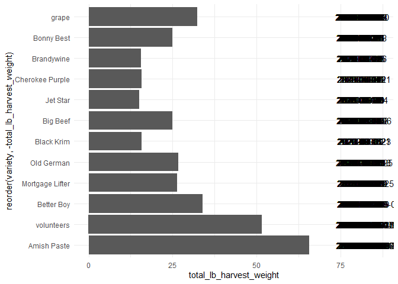<!-- -->

  5. In the `garden_harvest` data, create two new variables: one that makes the varieties lowercase and another that finds the length of the variety name. Arrange the data by vegetable and length of variety name (smallest to largest), with one row for each vegetable variety. HINT: use `str_to_lower()`, `str_length()`, and `distinct()`.
  

```r
garden_harvest %>%
  mutate(lower_variety = str_to_lower(variety), variety_len = str_length(variety)) %>%
  group_by(vegetable) %>%
  distinct(variety, .keep_all = TRUE) %>%
  arrange(variety_len)
```

<div data-pagedtable="false">
  <script data-pagedtable-source type="application/json">
{"columns":[{"label":["vegetable"],"name":[1],"type":["chr"],"align":["left"]},{"label":["variety"],"name":[2],"type":["chr"],"align":["left"]},{"label":["date"],"name":[3],"type":["date"],"align":["right"]},{"label":["weight"],"name":[4],"type":["dbl"],"align":["right"]},{"label":["units"],"name":[5],"type":["chr"],"align":["left"]},{"label":["lower_variety"],"name":[6],"type":["chr"],"align":["left"]},{"label":["variety_len"],"name":[7],"type":["int"],"align":["right"]}],"data":[{"1":"potatoes","2":"red","3":"2020-10-15","4":"1718","5":"grams","6":"red","7":"3"},{"1":"hot peppers","2":"thai","3":"2020-07-20","4":"12","5":"grams","6":"thai","7":"4"},{"1":"tomatoes","2":"grape","3":"2020-07-11","4":"24","5":"grams","6":"grape","7":"5"},{"1":"jalapeño","2":"giant","3":"2020-07-17","4":"20","5":"grams","6":"giant","7":"5"},{"1":"peppers","2":"green","3":"2020-08-04","4":"81","5":"grams","6":"green","7":"5"},{"1":"pumpkins","2":"saved","3":"2020-09-01","4":"4758","5":"grams","6":"saved","7":"5"},{"1":"lettuce","2":"reseed","3":"2020-06-06","4":"20","5":"grams","6":"reseed","7":"6"},{"1":"beets","2":"leaves","3":"2020-06-11","4":"8","5":"grams","6":"leaves","7":"6"},{"1":"lettuce","2":"Tatsoi","3":"2020-06-20","4":"18","5":"grams","6":"tatsoi","7":"6"},{"1":"carrots","2":"Dragon","3":"2020-07-24","4":"80","5":"grams","6":"dragon","7":"6"},{"1":"carrots","2":"Bolero","3":"2020-07-30","4":"116","5":"grams","6":"bolero","7":"6"},{"1":"potatoes","2":"purple","3":"2020-08-06","4":"317","5":"grams","6":"purple","7":"6"},{"1":"potatoes","2":"yellow","3":"2020-08-06","4":"439","5":"grams","6":"yellow","7":"6"},{"1":"carrots","2":"greens","3":"2020-08-29","4":"169","5":"grams","6":"greens","7":"6"},{"1":"potatoes","2":"Russet","3":"2020-09-16","4":"629","5":"grams","6":"russet","7":"6"},{"1":"hot peppers","2":"variety","3":"2020-07-20","4":"559","5":"grams","6":"variety","7":"7"},{"1":"peppers","2":"variety","3":"2020-07-24","4":"68","5":"grams","6":"variety","7":"7"},{"1":"broccoli","2":"Yod Fah","3":"2020-07-27","4":"372","5":"grams","6":"yod fah","7":"7"},{"1":"edamame","2":"edamame","3":"2020-08-11","4":"109","5":"grams","6":"edamame","7":"7"},{"1":"apple","2":"unknown","3":"2020-09-26","4":"156","5":"grams","6":"unknown","7":"7"},{"1":"spinach","2":"Catalina","3":"2020-06-11","4":"9","5":"grams","6":"catalina","7":"8"},{"1":"cilantro","2":"cilantro","3":"2020-06-23","4":"2","5":"grams","6":"cilantro","7":"8"},{"1":"cucumbers","2":"pickling","3":"2020-07-08","4":"181","5":"grams","6":"pickling","7":"8"},{"1":"tomatoes","2":"Big Beef","3":"2020-07-21","4":"137","5":"grams","6":"big beef","7":"8"},{"1":"tomatoes","2":"Jet Star","3":"2020-07-28","4":"315","5":"grams","6":"jet star","7":"8"},{"1":"squash","2":"delicata","3":"2020-09-19","4":"307","5":"grams","6":"delicata","7":"8"},{"1":"squash","2":"Red Kuri","3":"2020-09-19","4":"1178","5":"grams","6":"red kuri","7":"8"},{"1":"chives","2":"perrenial","3":"2020-06-17","4":"8","5":"grams","6":"perrenial","7":"9"},{"1":"strawberries","2":"perrenial","3":"2020-06-18","4":"40","5":"grams","6":"perrenial","7":"9"},{"1":"asparagus","2":"asparagus","3":"2020-06-20","4":"20","5":"grams","6":"asparagus","7":"9"},{"1":"Swiss chard","2":"Neon Glow","3":"2020-06-21","4":"19","5":"grams","6":"neon glow","7":"9"},{"1":"raspberries","2":"perrenial","3":"2020-06-29","4":"30","5":"grams","6":"perrenial","7":"9"},{"1":"zucchini","2":"Romanesco","3":"2020-07-06","4":"175","5":"grams","6":"romanesco","7":"9"},{"1":"tomatoes","2":"Bonny Best","3":"2020-07-21","4":"339","5":"grams","6":"bonny best","7":"10"},{"1":"carrots","2":"King Midas","3":"2020-07-23","4":"56","5":"grams","6":"king midas","7":"10"},{"1":"tomatoes","2":"Better Boy","3":"2020-07-24","4":"220","5":"grams","6":"better boy","7":"10"},{"1":"tomatoes","2":"Old German","3":"2020-07-28","4":"611","5":"grams","6":"old german","7":"10"},{"1":"tomatoes","2":"Brandywine","3":"2020-08-01","4":"320","5":"grams","6":"brandywine","7":"10"},{"1":"tomatoes","2":"Black Krim","3":"2020-08-01","4":"436","5":"grams","6":"black krim","7":"10"},{"1":"tomatoes","2":"volunteers","3":"2020-08-04","4":"73","5":"grams","6":"volunteers","7":"10"},{"1":"tomatoes","2":"Amish Paste","3":"2020-07-25","4":"463","5":"grams","6":"amish paste","7":"11"},{"1":"beets","2":"Sweet Merlin","3":"2020-07-07","4":"10","5":"grams","6":"sweet merlin","7":"12"},{"1":"squash","2":"Blue (saved)","3":"2020-09-01","4":"3227","5":"grams","6":"blue (saved)","7":"12"},{"1":"basil","2":"Isle of Naxos","3":"2020-06-23","4":"5","5":"grams","6":"isle of naxos","7":"13"},{"1":"onions","2":"Delicious Duo","3":"2020-07-16","4":"50","5":"grams","6":"delicious duo","7":"13"},{"1":"corn","2":"Dorinny Sweet","3":"2020-08-11","4":"330","5":"grams","6":"dorinny sweet","7":"13"},{"1":"corn","2":"Golden Bantam","3":"2020-08-15","4":"383","5":"grams","6":"golden bantam","7":"13"},{"1":"lettuce","2":"mustard greens","3":"2020-06-29","4":"23","5":"grams","6":"mustard greens","7":"14"},{"1":"beets","2":"Gourmet Golden","3":"2020-07-07","4":"62","5":"grams","6":"gourmet golden","7":"14"},{"1":"lettuce","2":"Lettuce Mixture","3":"2020-07-22","4":"23","5":"grams","6":"lettuce mixture","7":"15"},{"1":"tomatoes","2":"Cherokee Purple","3":"2020-07-24","4":"247","5":"grams","6":"cherokee purple","7":"15"},{"1":"tomatoes","2":"Mortgage Lifter","3":"2020-07-27","4":"801","5":"grams","6":"mortgage lifter","7":"15"},{"1":"radish","2":"Garden Party Mix","3":"2020-06-06","4":"36","5":"grams","6":"garden party mix","7":"16"},{"1":"kale","2":"Heirloom Lacinto","3":"2020-06-13","4":"10","5":"grams","6":"heirloom lacinto","7":"16"},{"1":"peas","2":"Magnolia Blossom","3":"2020-06-17","4":"8","5":"grams","6":"magnolia blossom","7":"16"},{"1":"peas","2":"Super Sugar Snap","3":"2020-06-17","4":"121","5":"grams","6":"super sugar snap","7":"16"},{"1":"rutabaga","2":"Improved Helenor","3":"2020-10-16","4":"883","5":"grams","6":"improved helenor","7":"16"},{"1":"beans","2":"Bush Bush Slender","3":"2020-07-06","4":"235","5":"grams","6":"bush bush slender","7":"17"},{"1":"broccoli","2":"Main Crop Bravado","3":"2020-09-09","4":"102","5":"grams","6":"main crop bravado","7":"17"},{"1":"kohlrabi","2":"Crispy Colors Duo","3":"2020-09-17","4":"191","5":"grams","6":"crispy colors duo","7":"17"},{"1":"squash","2":"Waltham Butternut","3":"2020-09-19","4":"1834","5":"grams","6":"waltham butternut","7":"17"},{"1":"pumpkins","2":"New England Sugar","3":"2020-09-19","4":"1109","5":"grams","6":"new england sugar","7":"17"},{"1":"beans","2":"Chinese Red Noodle","3":"2020-08-08","4":"108","5":"grams","6":"chinese red noodle","7":"18"},{"1":"beans","2":"Classic Slenderette","3":"2020-08-05","4":"41","5":"grams","6":"classic slenderette","7":"19"},{"1":"onions","2":"Long Keeping Rainbow","3":"2020-07-20","4":"102","5":"grams","6":"long keeping rainbow","7":"20"},{"1":"lettuce","2":"Farmer's Market Blend","3":"2020-06-11","4":"12","5":"grams","6":"farmer's market blend","7":"21"},{"1":"pumpkins","2":"Cinderella's Carraige","3":"2020-09-01","4":"7350","5":"grams","6":"cinderella's carraige","7":"21"}],"options":{"columns":{"min":{},"max":[10]},"rows":{"min":[10],"max":[10]},"pages":{}}}
  </script>
</div>

  6. In the `garden_harvest` data, find all distinct vegetable varieties that have "er" or "ar" in their name. HINT: `str_detect()` with an "or" statement (use the | for "or") and `distinct()`.


```r
garden_harvest %>%
  mutate(lower_variety = str_to_lower(variety), variety_len = str_length(variety)) %>%
  group_by(vegetable) %>%
  distinct(variety, .keep_all = TRUE) %>%
  mutate(has_ar = str_detect(lower_variety, "ar"), has_er = str_detect(lower_variety, "er")) %>%
  filter(has_ar == TRUE | has_er == TRUE) %>%
  head()
```

<div data-pagedtable="false">
  <script data-pagedtable-source type="application/json">
{"columns":[{"label":["vegetable"],"name":[1],"type":["chr"],"align":["left"]},{"label":["variety"],"name":[2],"type":["chr"],"align":["left"]},{"label":["date"],"name":[3],"type":["date"],"align":["right"]},{"label":["weight"],"name":[4],"type":["dbl"],"align":["right"]},{"label":["units"],"name":[5],"type":["chr"],"align":["left"]},{"label":["lower_variety"],"name":[6],"type":["chr"],"align":["left"]},{"label":["variety_len"],"name":[7],"type":["int"],"align":["right"]},{"label":["has_ar"],"name":[8],"type":["lgl"],"align":["right"]},{"label":["has_er"],"name":[9],"type":["lgl"],"align":["right"]}],"data":[{"1":"radish","2":"Garden Party Mix","3":"2020-06-06","4":"36","5":"grams","6":"garden party mix","7":"16","8":"TRUE","9":"FALSE"},{"1":"lettuce","2":"Farmer's Market Blend","3":"2020-06-11","4":"12","5":"grams","6":"farmer's market blend","7":"21","8":"TRUE","9":"TRUE"},{"1":"peas","2":"Super Sugar Snap","3":"2020-06-17","4":"121","5":"grams","6":"super sugar snap","7":"16","8":"TRUE","9":"TRUE"},{"1":"chives","2":"perrenial","3":"2020-06-17","4":"8","5":"grams","6":"perrenial","7":"9","8":"FALSE","9":"TRUE"},{"1":"strawberries","2":"perrenial","3":"2020-06-18","4":"40","5":"grams","6":"perrenial","7":"9","8":"FALSE","9":"TRUE"},{"1":"asparagus","2":"asparagus","3":"2020-06-20","4":"20","5":"grams","6":"asparagus","7":"9","8":"TRUE","9":"FALSE"}],"options":{"columns":{"min":{},"max":[10]},"rows":{"min":[10],"max":[10]},"pages":{}}}
  </script>
</div>


## Bicycle-Use Patterns

In this activity, you'll examine some factors that may influence the use of bicycles in a bike-renting program.  The data come from Washington, DC and cover the last quarter of 2014.

<center>

{width="30%"}


{width="30%"}

</center>

Two data tables are available:

- `Trips` contains records of individual rentals
- `Stations` gives the locations of the bike rental stations

Here is the code to read in the data. We do this a little differently than usual, which is why it is included here rather than at the top of this file. To avoid repeatedly re-reading the files, start the data import chunk with `{r cache = TRUE}` rather than the usual `{r}`.


```r
data_site <- 
  "https://www.macalester.edu/~dshuman1/data/112/2014-Q4-Trips-History-Data-Small.rds" 
Trips <- readRDS(gzcon(url(data_site)))
Stations<-read_csv("http://www.macalester.edu/~dshuman1/data/112/DC-Stations.csv")
```

**NOTE:** The `Trips` data table is a random subset of 10,000 trips from the full quarterly data. Start with this small data table to develop your analysis commands. **When you have this working well, you should access the full data set of more than 600,000 events by removing `-Small` from the name of the `data_site`.**

### Temporal patterns

It's natural to expect that bikes are rented more at some times of day, some days of the week, some months of the year than others. The variable `sdate` gives the time (including the date) that the rental started. Make the following plots and interpret them:

  7. A density plot, which is a smoothed out histogram, of the events versus `sdate`. Use `geom_density()`.
  

```r
Trips %>%
  ggplot(aes(x = sdate)) +
  geom_density() +
  labs(title = "Bike rental distribution by month")
```

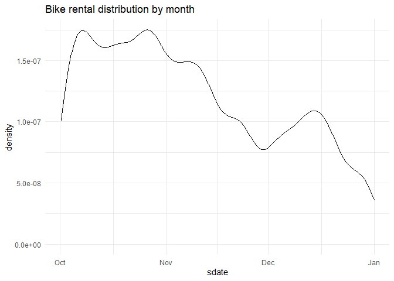<!-- -->
  
  8. A density plot of the events versus time of day.  You can use `mutate()` with `lubridate`'s  `hour()` and `minute()` functions to extract the hour of the day and minute within the hour from `sdate`. Hint: A minute is 1/60 of an hour, so create a variable where 3:30 is 3.5 and 3:45 is 3.75.
  

```r
Trips %>%
  mutate(time = hour(sdate) + (minute(sdate) / 60)) %>%
  ggplot(aes(x = time)) +
  geom_density() +
  labs(title = "Bike rental distribution taken by hour")
```

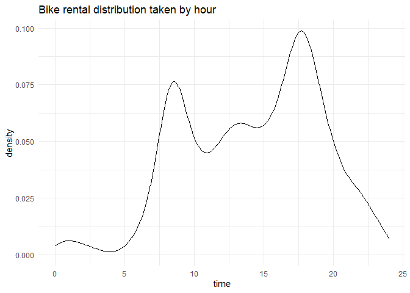<!-- -->
  
  9. A bar graph of the events versus day of the week. Put day on the y-axis.
  

```r
Trips %>%
  mutate(week_day = wday(sdate, label = TRUE)) %>%
  ggplot(aes(y = week_day)) +
  geom_bar() +
  labs(title = "Bike rental counts by day")
```

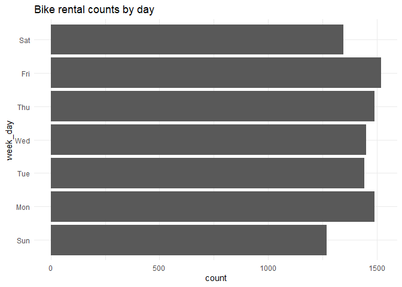<!-- -->
  
  10. Facet your graph from exercise 8. by day of the week. Is there a pattern?
  

```r
Trips %>%
  mutate(time = hour(sdate) + (minute(sdate) / 60)) %>%
  mutate(week_day = wday(sdate, label = TRUE)) %>%
  ggplot(aes(x = time)) +
  geom_density() +
  facet_wrap(week_day  ~ .) +
  labs(title = "Bike Rental Distributions by hour on each day of the week")
```

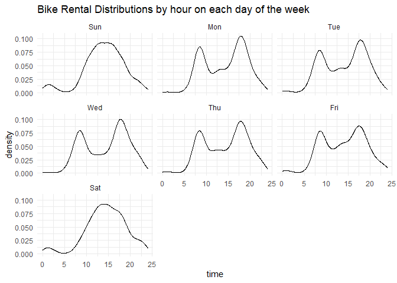<!-- -->
  
The variable `client` describes whether the renter is a regular user (level `Registered`) or has not joined the bike-rental organization (`Causal`). The next set of exercises investigate whether these two different categories of users show different rental behavior and how `client` interacts with the patterns you found in the previous exercises. 

  11. Change the graph from exercise 10 to set the `fill` aesthetic for `geom_density()` to the `client` variable. You should also set `alpha = .5` for transparency and `color=NA` to suppress the outline of the density function.
  

```r
Trips %>%
  mutate(time = hour(sdate) + (minute(sdate) / 60)) %>%
  mutate(week_day = wday(sdate, label = TRUE)) %>%
  ggplot(aes(x = time, fill = client)) +
  geom_density(alpha = 0.5, color ='NA') +
  facet_wrap(week_day  ~ .) +
  labs(title = "Bike rental distribution by day compared between client status.")
```

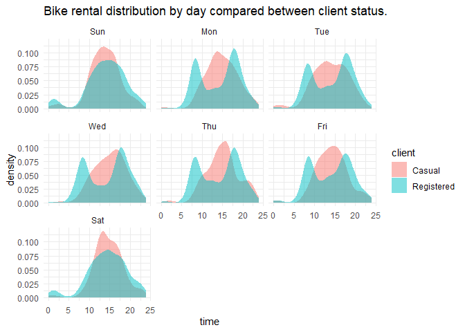<!-- -->

  12. Change the previous graph by adding the argument `position = position_stack()` to `geom_density()`. In your opinion, is this better or worse in terms of telling a story? What are the advantages/disadvantages of each?
  

```r
Trips %>%
  mutate(time = hour(sdate) + (minute(sdate) / 60)) %>%
  mutate(week_day = wday(sdate, label = TRUE)) %>%
  ggplot(aes(x = time, fill = client,)) +
  geom_density(alpha = 0.5, position = position_stack(), color ='NA') +
  facet_wrap(week_day  ~ .) +
  labs(title = "Bike rental distribution by day compared between client status.")
```

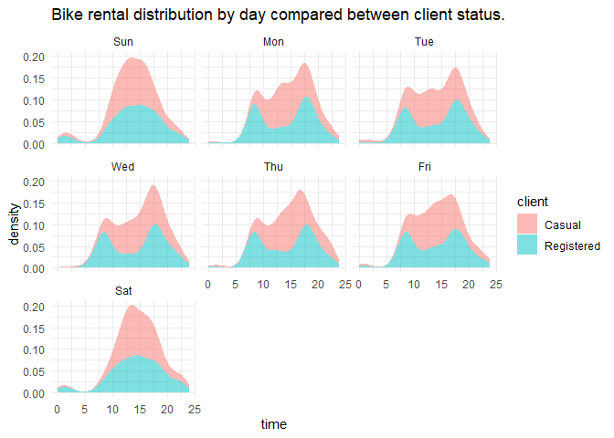
  
  13. In this graph, go back to using the regular density plot (without `position = position_stack()`). Add a new variable to the dataset called `weekend` which will be "weekend" if the day is Saturday or Sunday and  "weekday" otherwise (HINT: use the `ifelse()` function and the `wday()` function from `lubridate`). Then, update the graph from the previous problem by faceting on the new `weekend` variable. 
  

```r
Trips %>%
  mutate(time = hour(sdate) + (minute(sdate) / 60)) %>%
  mutate(week_day = wday(sdate, label = TRUE)) %>%
  mutate(weekend = ifelse(week_day == "Sun" | week_day == "Sat", "weekend", "weekday")) %>%
  ggplot(aes(x = time, fill = client)) +
  geom_density(alpha = 0.5, color ='NA') +
  facet_wrap(weekend  ~ .) +
  labs(title = "Bike rental distribution comparison from weekdays to weekends by client status")
```


  
  14. Change the graph from the previous problem to facet on `client` and fill with `weekday`. What information does this graph tell you that the previous didn't? Is one graph better than the other?
  

```r
Trips %>%
  mutate(time = hour(sdate) + (minute(sdate) / 60)) %>%
  mutate(week_day = wday(sdate, label = TRUE)) %>%
  mutate(weekend = ifelse(week_day == "Sun" | week_day == "Sat", "weekend", "weekday")) %>%
  ggplot(aes(x = time, fill = week_day)) +
  geom_density(alpha = 0.5, color ='NA') +
  facet_wrap(client  ~ .) +
  labs(title = "Biking rentals distribution by day based on client status")
```

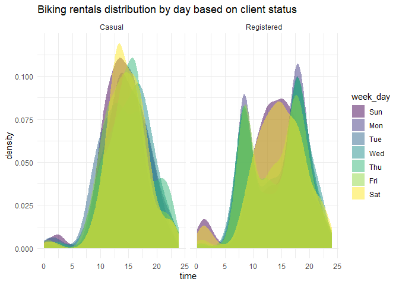
  
### Spatial patterns

  15. Use the latitude and longitude variables in `Stations` to make a visualization of the total number of departures from each station in the `Trips` data. Use either color or size to show the variation in number of departures. We will improve this plot next week when we learn about maps!
  

```r
Stations %>%
  left_join(Trips, by = c("name" = "sstation")) %>%
  group_by(name) %>%
  mutate(week_day = wday(sdate, label = TRUE)) %>%
  mutate(weekend = ifelse(week_day == "Sun" | week_day == "Sat", "weekend", "weekday")) %>%
  ggplot(aes(x = long, y = lat)) +
  geom_point(alpha = 0.3) +
  labs(title = "Longitude and Latitude distribution of bike rentals")
```

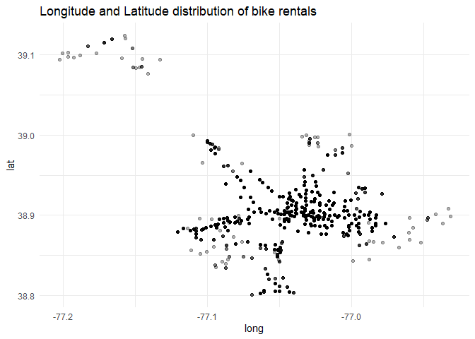
  
  16. Only 14.4% of the trips in our data are carried out by casual users. Create a plot that shows which area(s) have stations with a much higher percentage of departures by casual users. What patterns do you notice? (Again, we'll improve this next week when we learn about maps).
  

```r
Stations %>%
  left_join(Trips, by = c("name" = "sstation")) %>%
  group_by(name) %>%
  mutate(week_day = wday(sdate, label = TRUE)) %>%
  mutate(weekend = ifelse(week_day == "Sun" | week_day == "Sat", "weekend", "weekday")) %>%
  ggplot(aes(x = long, y = lat, color = client)) +
  geom_point(alpha = 0.3) + 
  labs(title = "Latitude and Longitude locations of bike trips by user type")
```

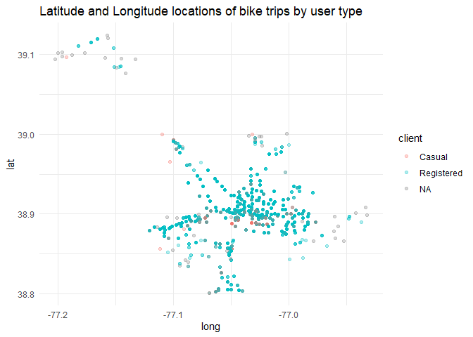

  
**DID YOU REMEMBER TO GO BACK AND CHANGE THIS SET OF EXERCISES TO THE LARGER DATASET? IF NOT, DO THAT NOW.**

## Dogs!

In this section, we'll use the data from 2022-02-01 Tidy Tuesday. If you didn't use that data or need a little refresher on it, see the [website](https://github.com/rfordatascience/tidytuesday/blob/master/data/2022/2022-02-01/readme.md).

  17. The final product of this exercise will be a graph that has breed on the y-axis and the sum of the numeric ratings in the `breed_traits` dataset on the x-axis, with a dot for each rating. First, create a new dataset called `breed_traits_total` that has two variables -- `Breed` and `total_rating`. The `total_rating` variable is the sum of the numeric ratings in the `breed_traits` dataset (we'll use this dataset again in the next problem). Then, create the graph just described. Omit Breeds with a `total_rating` of 0 and order the Breeds from highest to lowest ranked. You may want to adjust the `fig.height` and `fig.width` arguments inside the code chunk options (eg. `{r, fig.height=8, fig.width=4}`) so you can see things more clearly - check this after you knit the file to assure it looks like what you expected.


```r
breed_traits_total <-
  breed_traits

breed_traits_total <-
  select(breed_traits_total, -"Coat Type", -"Coat Length")

breed_traits_total <-
  breed_traits_total %>%
  mutate(total_rating = rowSums(.[2:14])) %>%
  arrange(desc(total_rating))
  
breed_traits_total %>%
  ggplot(aes(y = Breed, x = total_rating)) +
  geom_point(stat = 'identity') +
  labs(title = "Dog Breeds ranked by total rating score")
```

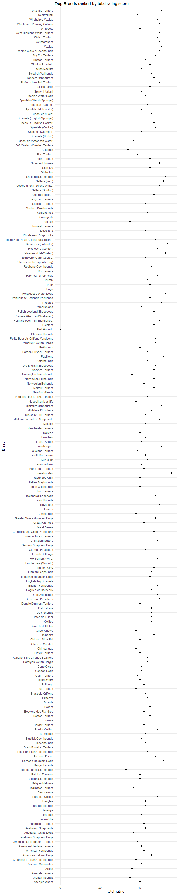

  18. The final product of this exercise will be a graph with the top-20 dogs in total ratings (from previous problem) on the y-axis, year on the x-axis, and points colored by each breed's ranking for that year (from the `breed_rank_all` dataset). The points within each breed will be connected by a line, and the breeds should be arranged from the highest median rank to lowest median rank ("highest" is actually the smallest numer, eg. 1 = best). After you're finished, think of AT LEAST one thing you could you do to make this graph better. HINTS: 1. Start with the `breed_rank_all` dataset and pivot it so year is a variable. 2. Use the `separate()` function to get year alone, and there's an extra argument in that function that can make it numeric. 3. For both datasets used, you'll need to `str_squish()` Breed before joining. 
  

```r
breed_rank_all <-
  breed_rank_all %>%
  mutate(Breed = str_squish(Breed))

breed_rank_all <-
  breed_rank_all %>%
  pivot_longer(cols = starts_with("20"),
                 names_to = "year",
               values_to = "ranking") %>%
  separate(year, "year", sep = " Rank", convert = TRUE)
```


```r
breed_rank_all %>% 
  left_join(breed_traits_total, by = "Breed") %>%
  na.omit() %>%
  arrange(desc(total_rating)) %>%
  head(20) %>%
  ggplot(aes(x = year, y= ranking, color = Breed)) +
  geom_point(aes(group = total_rating)) +
  labs(title = "20 Dogs (breed repeatable) with highest total rating over 7 years")
```

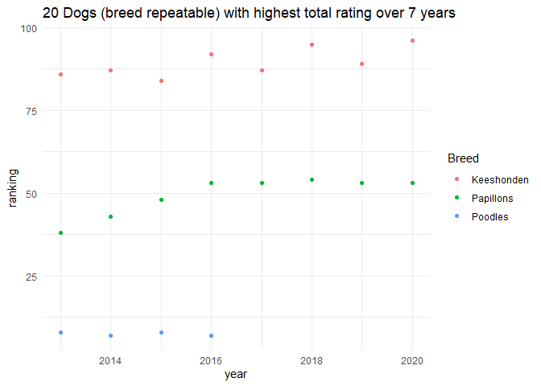<!-- -->
  
  19. Create your own! Requirements: use a `join` or `pivot` function (or both, if you'd like), a `str_XXX()` function, and a `fct_XXX()` function to create a graph using any of the dog datasets. One suggestion is to try to improve the graph you created for the Tidy Tuesday assignment. If you want an extra challenge, find a way to use the dog images in the `breed_rank_all` file - check out the `ggimage` library and [this resource](https://wilkelab.org/ggtext/) for putting images as labels.
  

```r
breed_traits_total %>% 
  left_join(breed_rank_all, by = "Breed")%>%
  mutate(isGreyhounds = str_detect(Breed, "Greyhounds"), isPugs = str_detect(Breed, "Pugs")) %>%
  filter(isGreyhounds == TRUE | isPugs == TRUE) %>%
  ggplot(aes(x = year, y = ranking, color = Breed)) +
  geom_point() +
  labs(title = "Greyhounds and Pugs ranking number over the past 7 years")
```

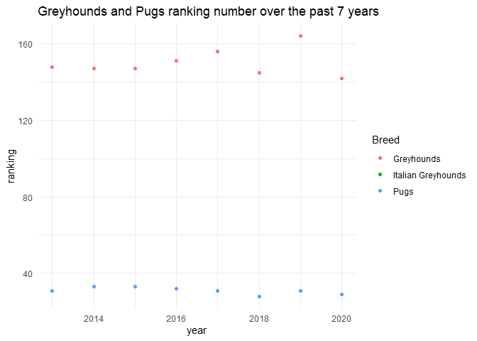<!-- -->
  
## GitHub link

  20. Below, provide a link to your GitHub page with this set of Weekly Exercises. Specifically, if the name of the file is 03_exercises.Rmd, provide a link to the 03_exercises.md file, which is the one that will be most readable on GitHub.
  
  [Github Link](https://github.com/Jmena413/STAT112-Week-3-Assignment)

## Challenge problem! 

This problem uses the data from the Tidy Tuesday competition this week, `kids`. If you need to refresh your memory on the data, read about it [here](https://github.com/rfordatascience/tidytuesday/blob/master/data/2020/2020-09-15/readme.md). 

  21. In this exercise, you are going to try to replicate the graph below, created by Georgios Karamanis. I'm sure you can find the exact code on GitHub somewhere, but **DON'T DO THAT!** You will only be graded for putting an effort into this problem. So, give it a try and see how far you can get without doing too much googling. HINT: use `facet_geo()`. The graphic won't load below since it came from a location on my computer. So, you'll have to reference the original html on the moodle page to see it.
  

**DID YOU REMEMBER TO UNCOMMENT THE OPTIONS AT THE TOP?**
